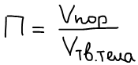
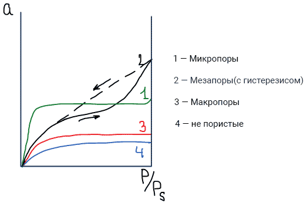
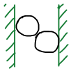
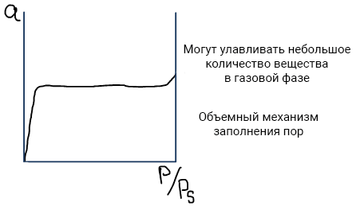
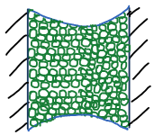
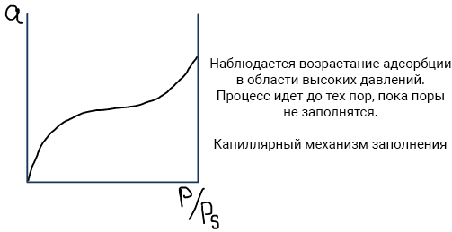
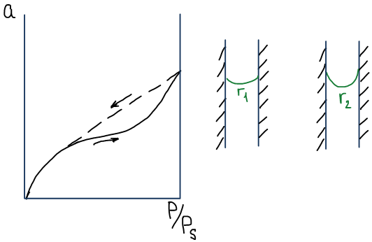
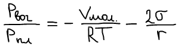
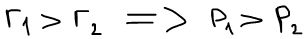

# Классификация сорбентов

**Пористость П** — доля объема пор в общем объеме пористого тела.

🙏 Если вам нравится сайт, подпишитесь на наш <a href="https://t.me/+JfpTv9CJlwQ0MThi">🔗 Телеграм-канал</a>.

## Классификация сорбентов

1. **По размерам пор** (Дубинин):
    * микропористые (r < 2 нм);
    * мезопористые (с переходными порами: 2 < r < 50 нм);
    * макропористые (r >50 нм);
    * непористые (есть только внешняя поверхность).
2. **По видам изотермической сорбции** (Киселев): 

## Механизмы заполнения пор

1. **Микропоры** (r < 2нм)

    

    Радиус поры меньше радиуса действия адсорбционного поля, значит адсорбционные поля от противоположных стенок перекрываются, тем самым усиливая адсорбционный потенциал и силу адсорбционного взаимодействия. Молекулы адсорбата с большой силой втягиваются в пору и всего несколько молекул заполняют весь объем пор.

    

2. **Мезопоры** (2 < r < 50 нм)

    

    На стенках пор появляется адсорбционный слой молекул. Адсорбционный слой сливается, конденсируются пары и происходит слияние жидких пленок. Если жидкость смачивает стенки пор, то образуется вогнутый мениск. Давление пара над вогнутой поверхностью меньше чем над плоской, поэтому происходит дальнейшая капиллярная конденсация.

    

3. **Макропоры** (r > 50 нм)

    Макропоры не отличаются от внешней поверхности. Слияния пленок не происходит.

## Капиллярные явления

Условия возникновения:

* адсорбат должен быть способен сжижаться (пар, а не газ);
* сорбент должен иметь радиус пор от 2 до 50 нм (мезо-);
* жидкий адсорбат должен смачивать стенки пор.

Изотермы необратимы, наблюдают сорбционный гистерезис, т.к. при процессах адсорбции и десорбции смачивание пор разное:

* в случае адсорбции в порах остаются следы воздуха, которые препятствуют полному смачиванию (мениск с r1);
* на обратном процессе воздуха нет, смачиванию ничто не мешает (мениск с r2).

**Уравнение Томсона—Кельвина:**

 

Во избежание гистерезиса тщательно удаляют воздух.

