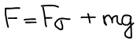

# Методы определения поверхностного натяжения

1.  [Метод капиллярного поднятия](#kapilarnoe-podniatie)
2.  [Метод максимального давления пузырька \(метод Ребиндера\)](#maximalnoe-davlene-puzirka)
3.  [Сталагмометрический метод \(метод счета капель\)](#stalagmometricheskiy-metod)
4.  [Метод отрыва кольца \(лаба по физике на первом курсе\)](#metod-otryva-kolca)

## Метод капиллярного поднятия

Для тонких капилляров радиус кривизны можно считать равным радиусу капилляра:

## Метод максимального давления пузырька \(метод Ребиндера\)

Капилляр сообщается с атмосферным воздухом, поэтому внутри трубки поддерживается атмосферное давление P0.

Давление P над исследуемой жидкостью постепенно уменьшают с помощью водяного насоса. Разность давлений \(Pо−P\) стремится выдуть пузырек воздуха из капилляра в жидкость, но этому противодействует добавочное давление создаваемое силами поверхностного натяжения жидкости в образующемся пузырьке радиуса r и направленное по касательной к поверхности раздела г-ж.

Наконец, при разности давлений \(Pо−P\), равной Pизб превышающей разность Pi,пл.–Pi,вог, из капиллярной трубки выдувается в жидкость воздушный пузырек.

Здесь неизвестен радиус r выдуваемого пузырька, измерить который крайне затруднительно. Поэтому прибегают к использованию эталонной жидкости, коэффициент поверхностного натяжения σo которой известен и близок к коэффициенту поверхностного натяжения σ исследуемой жидкости. При этом полагают, что радиусы пузырьков, выдуваемых из одного и того же капилляра в обоих случаях будут одинаковы.

Разделив первое уравнение на второе и решив относительно σ получим формулу для вычисления поверхностного натяжения:

## Сталагмометрический метод \(метод счета капель\)

Считают число капель \(n\), набирают в емкость и измеряют объем \(V\). Находят объем одной капли v.

где r — радиус шейки.

Т.к. радиус шейки посчитать сложно, проводят опыт с эталонной жидкостью.

 

## Метод отрыва кольца \(лаба по физике на первом курсе\)

На поверхность исследуемой жидкости помещают кольцо или рамку. Если жидкость смачивает кольцо, то силы поверхностного натяжения F1 и F2, действующие на его наружную и внутреннюю поверхности диаметрами D и d, направлены внутрь жидкости:

Суммарная сила поверхностного натяжения равна:

Чтобы оторвать кольцо от поверхности жидкости, надо приложить направленную вверх силу F, которая скомпенсирует силу тяжести mg кольца и силу поверхностного натяжения Fσ:

Измерив с помощью динамометра силу отрыва кольца и зная массу и размеры кольца можно определить поверхностное натяжение жидкости:

