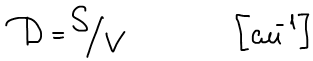
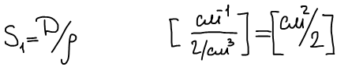
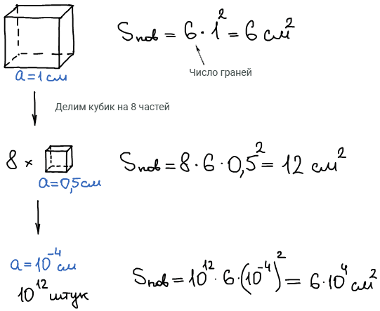

# Основные определения коллоидной химии

1861 г. Томас Грэм ввел термин коллоиды (κόλλα— клей).

Коллоидная химия — наука, изучающая вещества, находящиеся в дисперсном состоянии и поверхностные явления в дисперсных системах.

Диспергирование — тонкое измельчение твердого тела или жидкости, в результате которого образуются порошки, суспензии, эмульсии.

Дисперсная система — гетерогенная двух- или многофазная система, в которой одно вещество, находящееся в диспергированном состоянии (*дисперсная фаза*) распределено в среде другого (*дисперсионная среда*). Степень измельчения можно характеризовать следующими параметрами: линейным размером частиц **r**, дисперсностью **D**, либо удельной поверхностью **S1**.

Дисперсность — физическая величина, показывающая какое число частиц можно уложить вплотную в одном кубическом метре. Чем меньше размер частиц, тем больше дисперсность. Определяют как отношение суммарной поверхности раздела фаз  к объему этих частиц.

Удельная поверхность — это отношение суммарной поверхности к общей массе частиц.

Влияние диспергирования на свойства системы: высокая развитая поверхность.

Такая большая поверхность придает дисперсным системам особые свойства.

## Классификация дисперсных систем

По размерам частиц дисперсной фазы:

|**Размер частиц **|**Система**|
|**м**|**см**|
|10-10|10-8|Молекулярный раствор|
|10-9–10-8|10-7–10-6|Ультра-микро-дисперсная|
|10-8–10-6|10-6–10-4|микрогетерогенная (высокодисперсная)|
|\>10-6|\>10-4|Грубой дисперсии|

Различия между истинным раствором, коллоидной системой и грубой дисперисей:

|** **|**Истинный раствор**|**Коллоидная система**|**Грубая дисперсия**|
|**Видимость в оптическом микроскопе**|Нет|Нет|Видны|
|**Проходимость через бумажный фильтр**|Да|Да|Нет|
|**Через полупроницаемую перегородку**|Да|Нет|Нет|
|**Самопроизвольное образование**|Да, ΔG<0|Нет, ΔG\>0|Нет, ΔG\>0|
|**Термодинамическая устойчивость**|Да|Да/нет|Нет|
|**Гомогенность**|Да|Нет|Нет|

Классификация дисперсных систем по агрегатным состояниям дисперсной среды и дисперсной фазы:

|**№**|**Д.С.**|**Д.Ф.**|**Условное обозначение**|**Примеры:**|
|1|Тв|Тв|Т/Т|Минералы, сплавы, горные породы|
|2|Тв|Ж|Ж/Т|Почва, грунт, ткани жив. орг.|
|3|Тв|Г|Г/Т|Пористые тела, катализаторы в газах|
|4|Ж|Тв|Т/Ж|Суспензии, пасты, пульпы, золи|
|5|Ж|Ж|Ж/Ж|Эмульсии|
|6|Ж|Г|Г/Ж|Пены|
|7|Г|Тв|Т/Г|Пыль, порошки, дым|
|8|Г|Ж|Ж/Г|Облака, туман|
|9|Г|Г|—|—|

По характеру межмолекулярных взаимодействий между ДС и ДФ:

Эта классификация пригодна только для систем с жидкой дисперсионной средой.

1. Лиофильные. Термодинамические устойчивые (н-р: мыло в воде);

2. Лиофобные. Не устойчивы, слабые межмолекулярные взаимодействия (н-р: нафталин в воде).

Первоначально Зигмонди предложил классифицировать коллоидные растворы по способности сухого остатка, полученного в результате осторожного выпаривания жидкости, растворяться в чистой дисперсионной среде.

Системы, сухой остаток которых был не способен самопроизвольно диспергироваться в дисперсионной среде, он назвал *необратимыми* (н-р: лиозоли металлов, гидрозоли иодида серебра и т.д). *Обратимыми* коллоидными системами он назвал системы, сухой остаток которых при соприкосновении со средой обычно сначала набухает, а затем самопроизвольно растворяется и снова образует коллоидную систему (н-р: раствор желатина в воде или каучука в бензоле)

Фрейндлих высказал мнение, что обратимость и необратимость коллоидной системы определяется взаимодействием дисперсной фазы с дисперсной средой. В случае обратимых коллоидов есть взаимодействие между дисперсионной средой и фазой. Такие растворы называются *лиофильными* коллоидными растворами (если ДС — вода, то гидрофильными). А в случае необратимых — взаимодействия нет, следовательно ДФ не способна растворяться в ней. Такие системы Фрейндлих назвал *лиофобными* (гидрофобными, если ДС — вода).

