# Оптические свойства коллоидных систем

Оптические свойства коллоидных систем определяются их гетерогенностью и дисперсностью. Изучение оптических свойств позволяет решить множество задач, например, можно определить наличие коллоидных частиц, их размер, форму, концентрацию.

5 видов взаимодействия световой волны с веществом:

1. Поглощение;
2. Преломление;
3. Рассеяние;
4. Отражение;
5. Пропускание

Но в зависимости от длины волны и размеров частиц преобладают определенные виды:

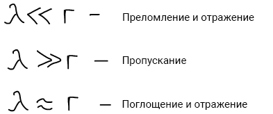

Если в системе нет никаких частиц с другим показателем преломления, то система будет считаться оптически пустой и рассеяния не будет. Если есть, то электрическое поле волны будет возбуждать электроны и начнется испускание света, при этом длина волны падающего света будет совпадать с рассеянным. В дисперсных системах источниками рассеяния света являются частицы дисперсной фазы.

**Эффект Тиндаля** — оптический эффект, рассеивание света при прохождении светового пучка через оптически неоднородную среду. Обычно наблюдается в виде светящегося конуса (**конус Тиндаля**), видимого на тёмном фоне.

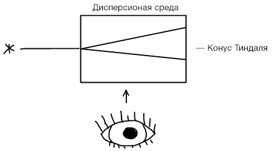

## Теория светорассеяния Рэлея

Джон Уильям Стретт, Лорд Рэлей (открыл аргон).

Рэлей рассматривал свою теорию для дисперсных частиц, размер которых примерно  равен 0.1λ , эти частицы имеют сферическую форму, не поглощают свет - есть только рассеяние, концентрация этих частиц достаточно мала, чтобы эффекты отдельных частиц не взаимодействовали друг с другом.

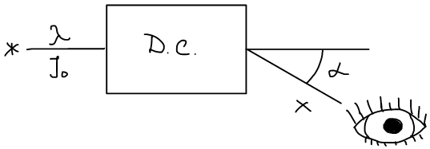

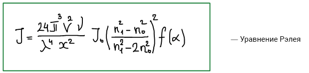

I0 — интенсивность падающего света, λ —длина волны падающего света, V —объем одной частицы дисперсной фазы, *ν* — частичная концентрация (число частиц в единице объема), n1 — показатель преломления дисперсной фазы, n0 — показатель преломления дисперсионной среды, х — расстояние до наблюдения, α — угол, под которым наблюдается рассеяние.

## Анализ закона Рэлея:

Интенсивность рассеянного света:

1. Сильнее всего зависит от длины волны.

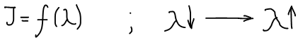

Красный свет рассеивается меньше всего, поэтому все сигнальные огни — красные, все маскировочные — синие.

2. Зависит от разницы в показателях преломления дисперсной фазы и дисперсионной среды.

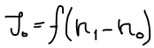

Чем больше разница — тем сильнее рассеяние.

3. Зависит от размера частиц дисперсной фазы.

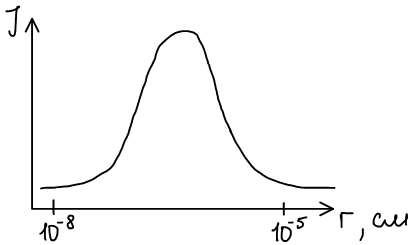

4. От концентрации

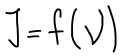

## Нефелометрия

**Нефелометрия** — метод изучения рассеянного света дисперсной системы под определенным углом.

 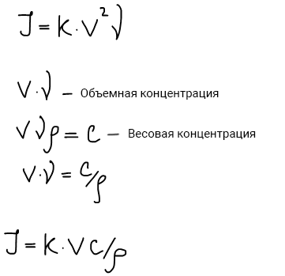

Обычно проводят два опыта для сравнения экспериментального значения со стандартным.

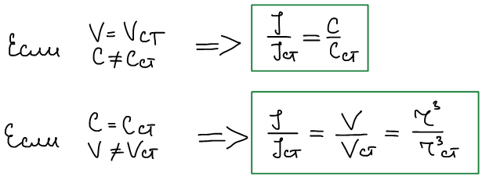

## Ультрамикроскопия

**Ультрамикроскопия** — оптический метод изучения, который основан на регистрации рассеяния от каждой частицы дисперсной фазы. Ультрамикроскоп позволяет наблюдать частицы коллоидных размеров. 1903г. Зигмонди Рихард сконструировал ультрамикроскоп (1925г. - Нобелевская премия).

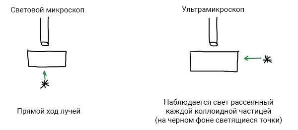

Что можно определить с помощью ультрамикроскопа?

1. Наличие коллоидных частиц; 2. Форма частиц. Ровный световой ареол — сферическая форма, мерцание — сложная поверхность; 3. Можем посчитать число частиц => концентрация частиц; 4. Размер частиц.

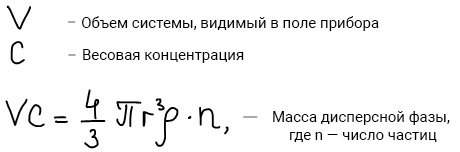 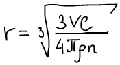

## Поточный ультрамикроскоп (Дерягин и Власенко)

Поток золя протекает через кювету, на которую направлен свет. Происходят вспышки каждой коллоидной частицы в ультрамикроскопе, которые автоматически регистрируются. Используется для определения дисперсности системы.

## Электронная микроскопия

**Разрешающая способность микроскопа**

— величина, обратная минимальному расстоянию между 2 точками, которые можно видеть независимо друг от друга.

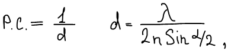

где n — показатель преломления среды.

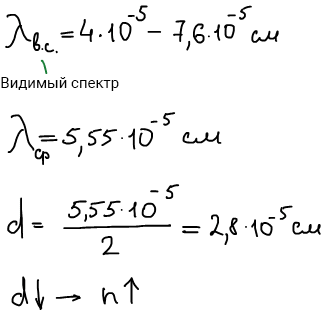

Для увеличения разрешающей способности используют иммерсионный метод.

**Иммерсионный метод** микроскопического наблюдения заключается во введении жидкости между объективом микроскопа и рассматриваемым предметом  для усиления яркости и расширения пределов увеличения изображения.

## Окраска коллоидных систем

Причины окраски:

1. Рассеяние света; 2. Поглощение. Система окрашивается в свет - дополнительный к поглощенному.

|Поглощенный свет|Окрашенный|
|Желтый|Синий|
|Красный|зеленый|

Похоже на поглощение света в истинных растворах: уравнение Бугера-Ламберта-Бэра:

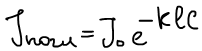

Поглощение света зависит от размера частиц (или от ее дисперсности) - чем меньше размер частицы, тем более короткие длины волн могут быть поглощены. Золь Au:

|Размер частиц, см|Поглощенный свет|Окрашено|
|5\*10-6|Желтый|Синий|
|2\*10-6|Зеленый|Красный|
|<10-6|Синий|Желтый|

Цвет системы зависит от размера частиц. Кроме того интенсивность поглощенного света тоже зависит от размера частиц (дисперсности системы).

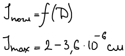

**Флюоресценция** — поглощение определенной длины волны и преобразование в волны большей длины.

**Опалесценция** — различие окраски систем в зависимости от угла наблюдения. Рассеиваются волны разной длины.

