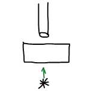
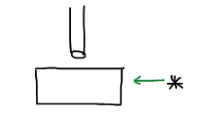

# Оптические свойства коллоидных систем

Оптические свойства коллоидных систем определяются их гетерогенностью и дисперсностью. Изучение оптических свойств позволяет решить множество задач, например, можно определить наличие коллоидных частиц, их размер, форму, концентрацию.

5 видов взаимодействия световой волны с веществом:

1. Поглощение;
2. Преломление;
3. Рассеяние;
4. Отражение;
5. Пропускание

Но в зависимости от длины волны и размеров частиц преобладают определенные виды:

$$
\lambda << r \qquad \text{— преломление} \\
\lambda >> r \qquad \text{— пропускание} \\
\lambda ≈ r \qquad \text{— поглощение и отражение} \\
$$

Если в системе нет никаких частиц с другим показателем преломления, то система будет считаться оптически пустой и рассеяния не будет. Если есть, то электрическое поле волны будет возбуждать электроны и начнется испускание света, при этом длина волны падающего света будет совпадать с рассеянным. В дисперсных системах источниками рассеяния света являются частицы дисперсной фазы.

**Эффект Тиндаля** — оптический эффект, рассеивание света при прохождении светового пучка через оптически неоднородную среду. Обычно наблюдается в виде светящегося конуса (**конус Тиндаля**), видимого на тёмном фоне.

## Теория светорассеяния Рэлея

Настоящее имя Рэлея Джон Уильям Стретт, Лорд Рэлей. Рэлей открыл открыл аргон.

Рэлей рассматривал свою теорию для дисперсных частиц, размер которых примерно равен $0.1λ$. Эти частицы имеют сферическую форму, не поглощают свет — есть только рассеяние, концентрация этих частиц достаточно мала, чтобы эффекты отдельных частиц не взаимодействовали друг с другом.

Уравнение Рэлея

$$
J = \frac{24\pi^3V^2\nu}{\lambda^4x^2}J_0\left(\frac{n_1^2-n_0^2}{n_1^2-2n_0^2}\right)^2f(\alpha),
$$

где:

* $J_0$ — интенсивность падающего света;
* $\lambda$ — длина волны падающего света;
* $V$ — объем одной частицы дисперсной фазы;
* $\nu$ — частичная концентрация (число частиц в единице объема);
* $n_1$ — показатель преломления дисперсной фазы;
* $n_0$ — показатель преломления дисперсионной среды;
* $х$ — расстояние до наблюдения;
* $α$ — угол, под которым наблюдается рассеяние.

В общем случае уравнение Рэлея упрощается к виду

$$
J = KV^2\nu,
$$

где $K$ — константа прибора

$$
K = \frac{24\pi^3}{\lambda^4x^2}J_0\left(\frac{n_1^2-n_0^2}{n_1^2-2n_0^2}\right)^2f(\alpha),
$$

## Анализ закона Рэлея

Интенсивность рассеянного света:

1. Сильнее всего зависит от длины волны.

    $$
    J=f(\lambda)\qquad \lambda\downarrow \longrightarrow J\uparrow
    $$
    Красный свет рассеивается меньше всего, поэтому все сигнальные огни — красные, все маскировочные — синие.

2. Зависит от разницы в показателях преломления дисперсной фазы и дисперсионной среды.

    $$
    J_0=f(n_1-n_0)
    $$

    Чем больше разница — тем сильнее рассеяние.

3. Зависит от размера частиц дисперсной фазы.

    

4. От концентрации

    $$
    J = f(\nu)
    $$

## Нефелометрия

**Нефелометрия** — метод изучения рассеянного света дисперсной системы под определенным углом.

Упрощенное уравнение Рэлея

$$
J = KV^2\nu
$$

$$
V\nu \qquad\text{ — объемная концентрация} \\
V\nu\rho=C \quad\text{ — весовая концентрация} \\
V\nu=C/\rho
$$

$$
J = KVC/\rho
$$

Обычно проводят два опыта для сравнения экспериментального значения со стандартным.

$$
\text{Если} \left.
    \begin{array}{ccc}
        V= V_{ст}\\
        C\neq C_{ст}
    \end{array}
\right. \Longrightarrow \frac{J}{J_{ст}} = \frac{C}{C_{ст}}
$$

$$
\text{Если} \left.
    \begin{array}{ccc}
        V \neq V_{ст}\\
        C = C_{ст}
    \end{array}
\right. \Longrightarrow \frac{J}{J_{ст}} = \frac{V}{V_{ст}} = \frac{r^2}{r_{ст}^3}
$$

## Ультрамикроскопия

**Ультрамикроскопия** — оптический метод изучения, который основан на регистрации рассеяния от каждой частицы дисперсной фазы. Ультрамикроскоп позволяет наблюдать частицы коллоидных размеров. 1903г. Зигмонди Рихард сконструировал ультрамикроскоп (1925г. - Нобелевская премия).

Схема работы светового микроскопа: прямой ход лучей

где $*$ — источник света.

Схема работы ультрамикроскопа:

В ультрамикроскопе наблюдается свет рассеянный каждой коллоидной частицей — на черном фоне светящиеся точки.

С помощью ультрамикроскопа можно определить:

* наличие коллоидных частиц;
* форму частиц. Ровный световой ареол — сферическая форма, мерцание — сложная поверхность;
* можем посчитать число частиц $\Rightarrow$ концентрацию частиц;
* размер частиц.

$V$ — объем системы, который виден в поле прибора

$C$ — весовая концентрация

Масса дисперсной фазы вычисляется уравнением

$$
VC = \frac{4}{3}\pi r^3\rho \cdot n,
$$

где $n$ — число частиц

$$
r = \sqrt[3]{\frac{3VC}{4\pi \rho n}}
$$

## Поточный ультрамикроскоп (Дерягин и Власенко)

Поток золя протекает через кювету, на которую направлен свет. Происходят вспышки каждой коллоидной частицы в ультрамикроскопе, которые автоматически регистрируются. Используется для определения дисперсности системы.

## Электронная микроскопия

**Разрешающая способность микроскопа** — величина, обратная минимальному расстоянию между 2 точками, которые можно видеть независимо друг от друга.

$$
Р.С. = \frac{1}{d} \qquad d =  \frac{\lambda}{2n \sin(\alpha/2)},
$$

где $n$ — показатель преломления среды.

Длина волны видимого спекта от $4\cdot10^{-5}$ до $7.6\cdot10^{-5}$ см.

$$
\lambda_{ср} = 5.55\cdot 10^{-5} см
$$

$$
d = \frac{5.55\cdot 10^{-5}}{2} = 2.8\cdot 10^{-5} см
$$

$$
d \downarrow \longrightarrow n\uparrow
$$

Для увеличения разрешающей способности используют иммерсионный метод.

**Иммерсионный метод** микроскопического наблюдения заключается во введении жидкости между объективом микроскопа и рассматриваемым предметом для усиления яркости и расширения пределов увеличения изображения.

$$
\lambda \downarrow \longrightarrow d\downarrow
$$

## Окраска коллоидных систем

Причины окраски:

* рассеяние света;
* поглощение.

Система окрашивается в свет - дополнительный к поглощенному.

| Поглощенный свет | Окрашенный |
| ---------------- | ---------- |
| Желтый           | Синий      |
| Красный          | зеленый    |

Похоже на поглощение света в истинных растворах: уравнение Бугера-Ламберта-Бэра:

$$
J_{погл} = J_0 e^{-KlC}
$$

Поглощение света зависит от размера частиц (или от ее дисперсности) — чем меньше размер частицы, тем более короткие длины волн могут быть поглощены. Золь $Au$:

| Размер частиц, см | Поглощенный свет | Окрашено |
| ----------------- | ---------------- | -------- |
| $5\cdot10^{-6}$   | Желтый           | Синий    |
| $2\cdot10^{-6}$   | Зеленый          | Красный  |
| $<10^{-6}$        | Синий            | Желтый   |

Цвет системы зависит от размера частиц. Кроме того интенсивность поглощенного света тоже зависит от размера частиц (дисперсности системы).

$$
J_{погл}=f(D)
$$

$$
J_{max} = 2\cdot10^{-6} — 3.6\cdot10^{-6}
$$

**Флюоресценция** — поглощение определенной длины волны и преобразование в волны большей длины.

**Опалесценция** — различие окраски систем в зависимости от угла наблюдения. Рассеиваются волны разной длины.
