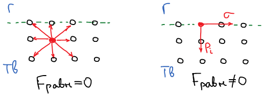
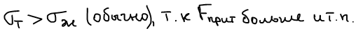
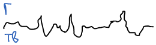
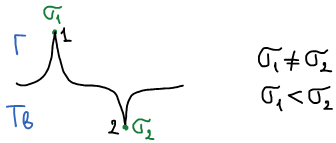

# Особые свойства поверхности твердого тела

1. Поверхностные частицы твердого тела обладают иными свойствами, чем частицы в глубине фазы

    

2. У частиц, находящихся на поверхности раздела фаз, есть внутреннее давление.

    

3. Поверхность твердого тела геометрически неоднородна

    

    Могут существовать различные дефекты

    

    2 центра:

    σ1 — центр химических взаимодействий (т.к. есть нескомпенсированность химических связей);

    σ2 — центр адсорбции (поры, впадины, трещины).

4. Твердые тела могут иметь пористую структуру, в которых есть внутренняя поверхность (пор). Внутренняя поверхность также участвует во взаимодействии с газом.

