# Поверхностные явления

Переходный слой — слой конечной толщины, свойства которого отличны от тех, что присущи фазе. Все поверхностные явления происходят здесь (высота в несколько молекулярных слоев). Молекулы переходного слоя находятся в динамическом равновесии с молекулами фазы (1 см2: 1 с ~ 1022 перемещений).

В глубине фазы межмолекулярные взаимодействия одинаковы и результирующая сила равна нулю. На поверхности концентрация молекул газа меньше концентрации молекул жидкости и результирующая сила не равна нулю (межмолекулярные силы не скомпенсированы). Молекулы находящиеся на поверхности "давят" на молекулы в глубине. Жидкость испытывает давление со стороны поверхностных молекул — внутреннее давление Pi.

**Внутреннее давление $P_i$** — равнодействующая сила межмолекулярного притяжения (взаимодействия) поверхностных молекул с молекулами фазы, направленная перпендикулярно к поверхности и отнесенная к единице площади поверхности.

$$
P_i=\left[\frac{Н}{м^2}\right]=\left[Па\right], атм
$$

$$
P_i(H_2O) = 13800 \text{ атм} \\
P_i(C_6H_6) = 3800 \text{ атм}
$$

Наличие внутреннего давления приводит к тому, что:

* жидкости малосжимаемы;
* все поверхностные молекулы стремятся уйти вглубь фазы, а значит жидкость принимает форму, при которой ее поверхность минимальна (сфера).

Чтобы создать новую поверхность необходимо затратить работу.

Двусторонняя пленка жидкости нанесена на проволочную рамку шириной l, одна сторона которой может перемещаться (без трения) вверх или вниз. В отсутствие внешней силы поверхность пленки самопроизвольно сокращается под действием поверхностного натяжения.

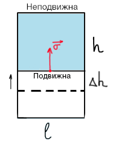

**Поверхностное натяжение жидкости** равно работе по созданию единицы поверхности.

$$
\sigma = \frac{A}{S}=\frac{F\Delta h}{l \Delta h}=\frac{F}{l}
$$

$$
\sigma = \left[\frac{\text{Дж}}{\text{м}^2}\right]=\left[\frac{\text{Н}}{\text{м}}\right]
$$

Также поверхностное натяжение представляет собой силу, стремящуюся сократить поверхность, отнесенную к единице поверхности и направленную по касательной к ней.

## Взаимосвязь внутреннего давления и поверхностного натяжения

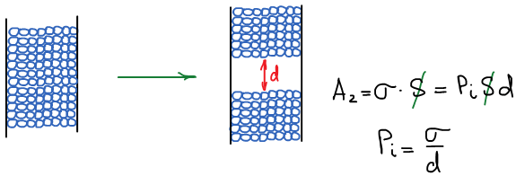

Работа по разделению равна:

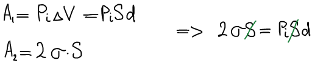 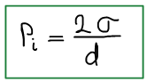

## Влияние различных факторов на $P_i$ и $σ$

### Влияние природы жидкости

Чаще всего зависит от того, полярная жидкость или неполярная, т.к. полярность определяет межмолекулярные взаимодействия. Так увеличение полярности жидкости, мерой которой является диэлектрическая проницаемость, приводит к увеличению межмолекулярного взаимодействия и, соответственно, к росту поверхностного натяжения.

**Относительная диэлектрическая проницаемость среды** показывает во сколько раз взаимодействие между зарядами в этой среде меньше, чем в вакууме.

| **Жидкость**    | **$ε$** | **$σ*10^3, Дж/м^2$** |
| --------------- | ------- | -------------------- |
| Н-гексан        | 1,9     | 18                   |
| Метиловый спирт | 26,3    | 30                   |
| Вода            | 81      | 72                   |

Чем выше полярность, тем выше поверхностное натяжение и внутренне давление.

### Влияние температуры

Чем выше температура, тем разница между фазами меньше (чем выше кинетическая энергия частиц, тем меньше нужно затратить энергии  дополнительно). С ростом температуры поверхностное натяжение падает (зависимость линейная).

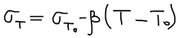

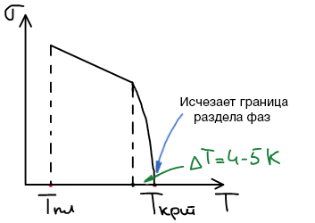 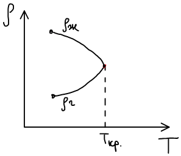

### Влияние кривизны поверхности

Поверхностное натяжение зависит от кривизны поверхности.

$σ = f (r_{кр})$

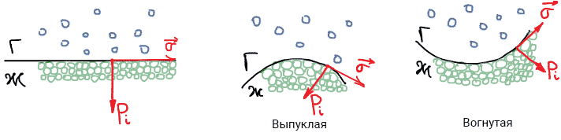

Если поверхность неправильной формы, то вводится средняя кривизна:

### Капиллярные явления

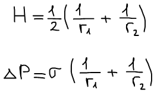 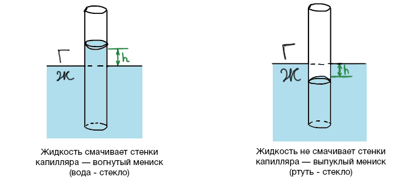

Поднятие/опускание жидкости в тонком капилляре имеет высокое практическое значение (подъем грунтовых вод, пропитка и окраска).

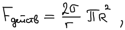

где r — радиус кривизны окружности, R — радиус капилляра.

