# Теории адсорбции

1.  [Теория молекулярной адсорбции Лэнгмюра](#teoriya-adsorbcii-lehngmyura)
2.  [Теория полимолекулярной адсорбции Поляни](#teoriya-adsorbcii-polyani)
3.  [Теория полимолекулярной адсорбции БЭТ](#teoriya-adsorbcii-bet)

## Теория молекулярной адсорбции Лэнгмюра

Лэнгмюр предположил, что на поверхности образуется 1 слой адсорбата в результате квазихимической реакции между адсорбентом и адсорбатом.

Основы теории:

-   Центры реакций — некие точки на неоднородной поверхности. Число активных центров меньше общего числа атомов на поверхности. Активные центры взаимодействуют с молекулами адсорбата;
-   1 активный центр может адсорбировать только одну молекулу адсорбата \(монослой\);
-   Нет взаимодействия между молекулами адсорбата на поверхности.

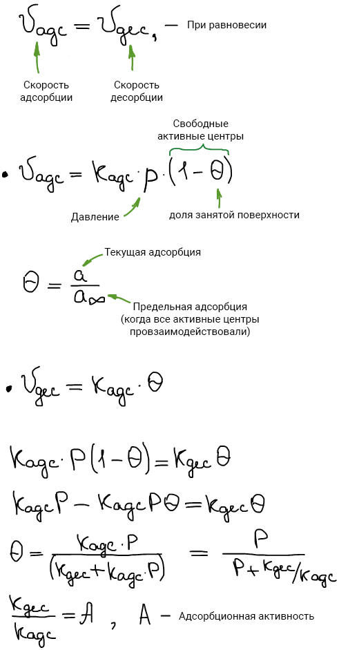

Уравнение адсорбции Лэнгмюра:

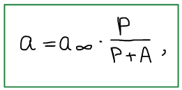

Где а — адсорбция при давлении p; а∞ — предельная адсорбция \(мономолекулярный слой заполнен\); А — величина адсорбционной активности.

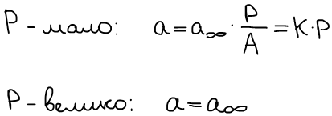

**Изотерма адсорбции Ленгмюра:**

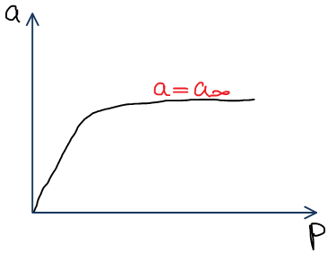

Часто бывает \(особенно при адсорбции пара\), что образуется полимолекулярный слой. Тогда теория Лэнгмюра не работает.

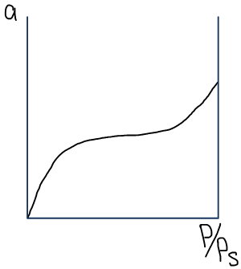

## Теория полимолекулярной адсорбции Поляни

На поверхности нет активных центров, а есть силовое поле, образующееся за счет межмолекулярных сил, в котором конденсируются молекулы адсорбата.

Основы теории:

-   Нет активных центров;
-   Адсорбционные силы — Ван-дер-Ваальсовы;
-   Силы действуют на расстояниях больше диаметра молекулы.
-   Существует некий адсорбционный объем, на который действует сила притяжения;
-   Молекулы адсорбата не взаимодействуют между собой;
-   Адсорбционные силы не зависят от температуры;
-   Адсорбционный объем не зависит от температуры;

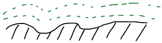

Возникают эквипотенциальные поверхности, которые повторяют рельеф. Силы убывают по мере удаления от поверхности. На некотором расстоянии заканчивается адсорбционный объем и начинается газовая фаза. За счет адсорбционных сил молекулы адсорбата попадают на поверхность твердого тела и конденсируются — описывается поведение пара.

Работа перехода вещества из газовой фазы в поверхность:

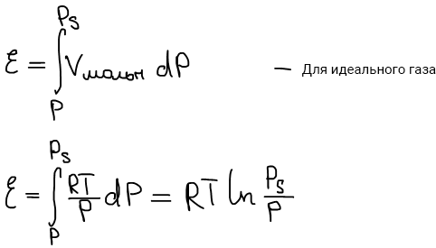

Потенциал меняется в зависимости от расстояния:

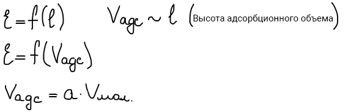 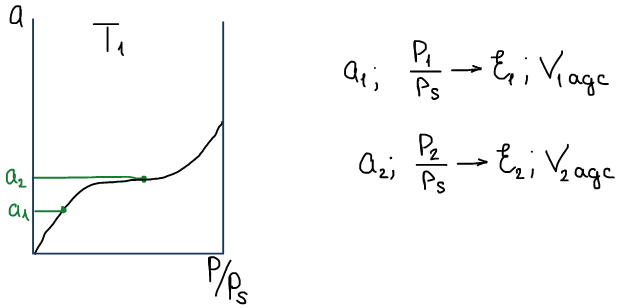

Т.е. можем рассчитать величину потенциала от величины Vадс.

**Характеристическая кривая Поляни**

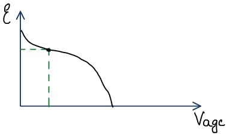

Характеризует данную систему адсорбент-адсорбат при всех Т. По ней можно рассчитать изотермы для других температур \(подставляем в формулы Т, находим P/Ps и получаем набор значений а и P/Ps\).

## Теория полимолекулярной адсорбции БЭТ

Брунауэр-Эммет-Теллер

Основы теории:

-   На поверхности твердого тела есть активные центры которые взаимодействуют с 1 молекулой адсорбата;
-   Горизонтальное взаимодействие отсутствует \(адсорбированные молекулы не взаимодействуют друг с другом\);
-   Адсорбированные молекулы первого слоя являются центрами адсорбции для второго слоя, второй слой — для третьего и т.д., т.е. образуется полимолекулярный слой.

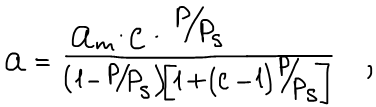

где а — текущая адсорбция при относительном давлении P/Ps; аm — количество адсорбированного вещества на 1 слое; C — постоянная, связанная с теплотой адсорбции.

Линейный вид:

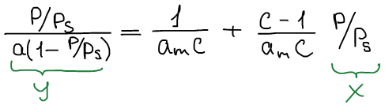

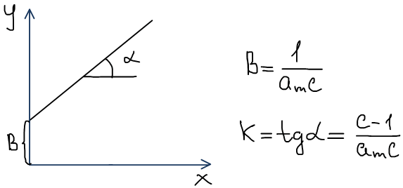

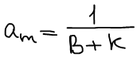

Изотерма полимолекулярной адсорбции:

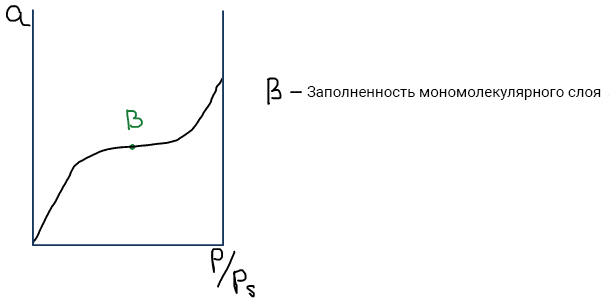

Недостатки:

-   Не учтено взаимодействие в горизонтальном слое;
-   Не учтена неоднородность поверхности;
-   Не учтено, то, что чем больше расстояние от поверхности, тем меньше взаимодействие.

