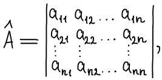
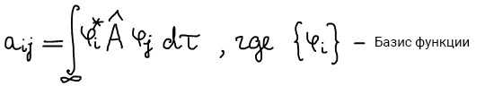
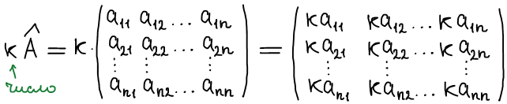
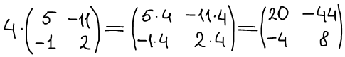
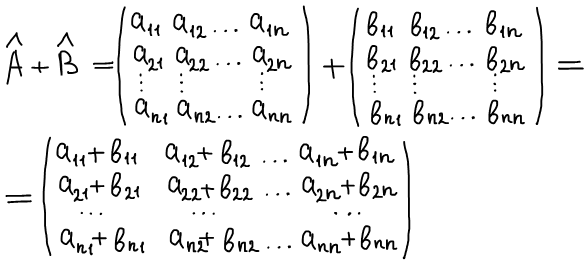

# Матричное представление операторов

Вернер Гейзенберг пришел к выводу, что в квантовой механике очень важен порядок действий: какой оператор первый, какой второй. Матричная аглебра как раз обладает таким свойством. Интересно, что он снова придумал матричную алгебру: физикам не читали матрицу, и он не имел представления об этом.

Каждому оператору физической величины в выбранном базисе пространства функций отвечает квадратная таблица чисел, называемая матричным представлением.

Элементы матричного представления рассчитываются по следующим формулам:

Подход в том, что операторы могут быть разные, но все они выражаются просто таблицей чисел. При этом все действия унифицируются (образуют единую систему).

Вспомним основные действия над матрицами (подробнее можно прочитать в литературе, или на сайтах [mathprofi.ru](http://www.mathprofi.ru/deistviya_s_matricami.html), [simumath.net](http://www.simumath.net/library/book.html?code=Matr_Alg_introduction)):

## Умножение матрицы на число

Пример:

## Сумма (разность) матриц

Не все матрицы можно складывать (вычитать), а только те, которые одинаковы по размеру.

## Пример 1. Сложение двух матриц разных размеров:

Такие матрицы нельзя складывать. Матрицу "два на два" можно складывать только с матрицей "два на два".

## Пример 2. Сложение двух матриц одинаковых размеров:

## Умножение матриц

Простой случай:

Пример:

Случай посложнее:

Пример:

Обратите внимание, что порядок умножения очень важен!

Матрицы специального вида:

Рассмотрим две диагональные матрицы M и L:

Каким должен быть базис, чтобы оператор имел вид диагональной матрицы?

Базис должен состоять из собственных функций этого оператора.

Собственные функции оператора являются нормированными и ортогональными.

## Правила вычисления определителя матрицы

Существует множество способов вычисления определителя матрицы, о которых вы можете также прочитать на сайте [mathprofi.ru](http://www.mathprofi.ru/kak_vychislit_opredelitel.html). Мы рассмотрим один из них:

