# Матричное представление операторов

Вернер Гейзенберг пришел к выводу, что в квантовой механике очень важен порядок действий: какой оператор первый, какой второй. Матричная аглебра как раз обладает таким свойством. Интересно, что он снова придумал матричную алгебру: физикам не читали матрицу, и он не имел представления об этом.

Каждому оператору физической величины в выбранном базисе пространства функций отвечает квадратная таблица чисел, называемая матричным представлением.

Элементы матричного представления рассчитываются по следующим формулам:

$$ 
\widehat{A} = \begin{vmatrix}
a_{11} & a_{12} & ... &a_{1j}\\
a_{21} & a_{22} & ... & a_{2j}\\
.. & ... & ... & ...\\
a_{j1} & a_{j2} & ... & a_{ij}\\
\end{vmatrix},
$$

$$

a_{ij}=\int\limits_{\infin} \varphi_i^*\widehat{A} \varphi_j d\tau, \text{где } \varphi_i \text{ — базис фунцкии}
$$

Подход в том, что операторы могут быть разные, но все они выражаются просто таблицей чисел. При этом все действия унифицируются (образуют единую систему).

Вспомним основные действия над матрицами (подробнее можно прочитать в литературе, или на сайтах [mathprofi.ru](http://www.mathprofi.ru/deistviya_s_matricami.html), [simumath.net](http://www.simumath.net/library/book.html?code=Matr_Alg_introduction)):

🙏 Если вам нравится сайт, подпишитесь на наш <a href="https://t.me/+JfpTv9CJlwQ0MThi">🔗 Телеграм-канал</a>.

## Умножение матрицы на число

$$ 
k\times\widehat{A} = k\times\begin{pmatrix}
a_{11} & a_{12} & ... &a_{1j}\\
a_{21} & a_{22} & ... & a_{2j}\\
.. & ... & ... & ...\\
a_{j1} & a_{j2} & ... & a_{ij}\\
\end{pmatrix} = \\
=\begin{pmatrix}
k\cdot a_{11} & k\cdot a_{12} & ... & k\cdot a_{1j}\\
k\cdot a_{21} & k\cdot  a_{22} & ... & k\cdot a_{2j}\\
.. & ... & ... & ...\\
k\cdot a_{j1} & k\cdot a_{j2} & ... & k\cdot a_{ij}\\
\end{pmatrix} 
$$

### Пример

$$ 
4\times\begin{pmatrix}
5 & -11\\
-1 & 2 \\
\end{pmatrix} = \begin{pmatrix}
4\cdot5 & 4\cdot-11\\
4\cdot-1 & 4\cdot2 \\
\end{pmatrix} = \begin{pmatrix}
20 & -44 \\
-4 & 8 \\
\end{pmatrix} 
$$

## Сумма и разность матриц

Матрицы можно складывать и вычитать, если они одинаковы по размеру.
$$
\widehat{A} + \widehat{B} = \begin{pmatrix}
a_{11} & a_{12} & ... &a_{1j}\\
a_{21} & a_{22} & ... & a_{2j}\\
.. & ... & ... & ...\\
a_{j1} & a_{j2} & ... & a_{ij}\\
\end{pmatrix} + \begin{pmatrix}
b_{11} & b_{12} & ... & b_{1j}\\
b_{21} & b_{22} & ... & b_{2j}\\
.. & ... & ... & ...\\
b_{j1} & b_{j2} & ... & b_{ij}\\
\end{pmatrix} = \\
= \begin{pmatrix}
a_{11} + b_{11} & a_{11} + b_{12} & ... & a_{1j} + b_{1j}\\
a_{21} + b_{21} & a_{22} + b_{22} & ... & a_{2j} + b_{2j}\\
.. & ... & ... & ...\\
a_{j1} + b_{j1} & a_{j2} + b_{j2} & ... & a_{ij} + b_{ij}\\
\end{pmatrix}
$$

### Пример 1: сложение двух матриц разных размеров

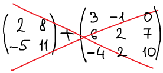

Такие матрицы нельзя складывать. Матрицу "два на два" можно складывать только с матрицей "два на два".

### Пример 2: cложение двух матриц одинаковых размеров:

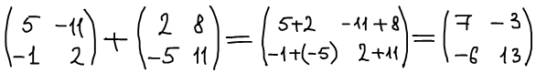

## Умножение матриц

Простой случай:

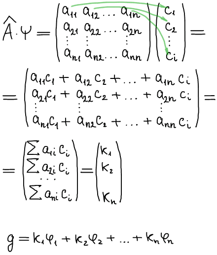

Пример:

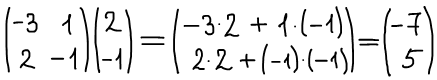

Случай посложнее:

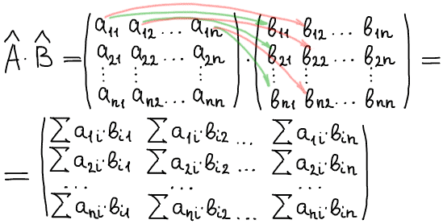

Пример:

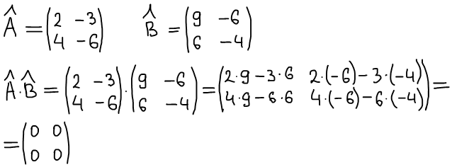

Обратите внимание, что порядок умножения очень важен!

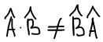

Матрицы специального вида:

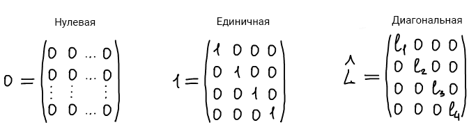

Рассмотрим две диагональные матрицы M и L:

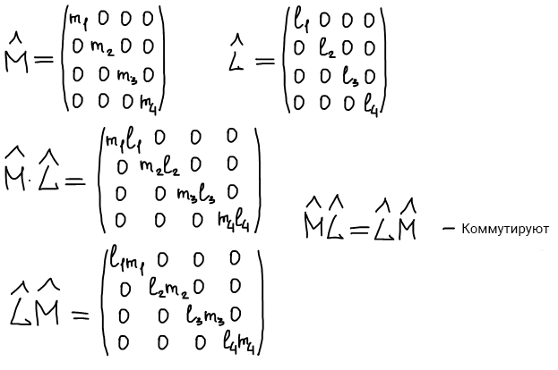

Каким должен быть базис, чтобы оператор имел вид диагональной матрицы?

Базис должен состоять из собственных функций этого оператора.

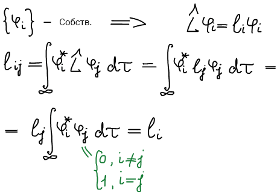

Собственные функции оператора являются нормированными и ортогональными.

## Правила вычисления определителя матрицы

Существует множество способов вычисления определителя матрицы, о которых вы можете также прочитать на сайте [mathprofi.ru](http://www.mathprofi.ru/kak_vychislit_opredelitel.html). Мы рассмотрим один из них:

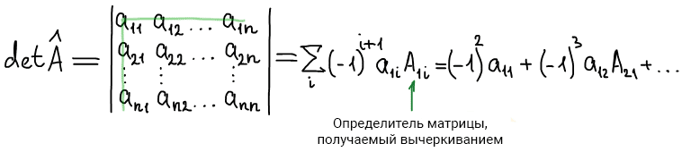

