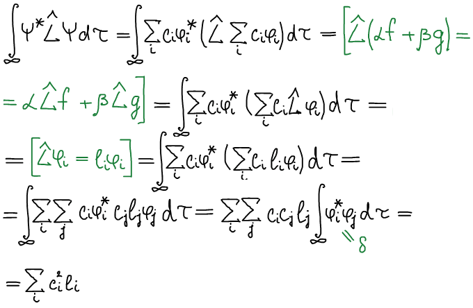
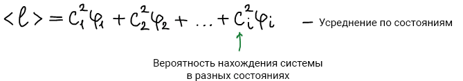

# Операторные уравнения

Пример опреаторного уравнения:

$$
\widehat H\Psi=E\Psi,
$$

где $\widehat H$ — оператор, $\Psi$ — функция.

Функция $f$, которая удовлетворяет операторному уравнению $\widehat Lf = lf$, называется **собственной функцией оператора**. Число (не переменная) $l$ называется **собственным значением оператора**.

$$
\widehat Lf = lf,
$$

где $l$ — собственное значение, $f$ — собственная функция оператора.

Например, рассмотрим оператор дифференцирования:

$$
\widehat{L} = \frac{d}{dx}
$$

1. $f=e^{kx}$

    $$
    \widehat{L}f = \frac{d}{dx}e^{kx} = \underset{\substack{\\
    \downarrow \\\\ 
    l}}
    {k}e^{kx}=lf
    $$

    Вывод: функция $f$ является собственной функцией оператора, собственное значение  $k$.

2. $f = x^2$

    $$
    \widehat{L}f = \frac{d}{dx}x^2 = 2x = \frac{2}{x}f\neq lf
    $$

    Вывод: функция $f$ не является собственной, так как не соответствует операторному уравнению ($l$ содержит в себе переменную).

Основная задача квантовой химии сводится к нахождению собственных функций и собственных значений оператора полной энергии для молекул.

## Является ли собственная функция единственной для оператора, или у него может быть несколько собственных функций?

Рассмотрим оператор дифференцирования:

$$
\widehat{L}=\frac{d}{dx}
$$

$$
e^{kx} \longrightarrow e^x,e^{2x},...,e^{kx}
$$
Собственное значение — $k$.

Для оператора может существовать различное множество собственных функций. Причем собственные функции самосопряженного оператора ортогональны друг другу и образуют базис пространства функций.

## Пусть есть разные операторы. Будут ли их собственные функции разными или они могут быть одинаковыми?

Если операторы коммутируют друг с другом , то они имеют общую систему собственных функций. Собственные функции коммутирующих операторов одни и те же.

## Всегда ли разным собственным функциям отвечают разные собственные значения?

Рассмотрим оператор дифференцирования:

$$
\widehat{L} = \frac{\partial}{\partial{x}}
$$

$$
f = e^{kx} \qquad \widehat{L}f = ke^{kx} = kf, \quad l_1 =k
$$

$$
g = ye^{kx} \qquad \widehat{L}g = kye^{kx} = kg, \quad l_2 =k
$$

$$
g\neq f\qquad l_1=l_2
$$

Собственные волновые функции для которых собственное значения одинаковые называются **вырожденными**.

## Физический смысл собственного значения

Запишем операторное уравнение:

$$
\widehat{L}f=lf
$$

Умножим левую и правую часть равнения на комплексно-сопряженную функцию $f^*$:

$$
f^*\widehat{L}f=f^*lf
$$

Проинтегрируем:

$$
\int\limits_{-\infin}^{+\infin}f^*\widehat{L}f d\tau = \int\limits_{-\infin}^{+\infin}f^*lf d\tau \Longrightarrow l\int\limits_{-\infin}^{+\infin}f^*f d\tau = 1
$$

$$
l = \int\limits_{-\infin}^{+\infin}f^*\widehat{L}f d\tau \text{ — 5 постулат}
$$

Собственное значение есть значение физической величины (из 5 постулата). Т.е. для оператора полной энергии системы (гамильтониана $H$) — собственное значение $E$ есть значение физической величины полной энергии системы.

1 следствие: константа $E$ в уравнении Шредингера является полной энергией системы.

$$
\widehat{H}\Psi = E\Psi
$$

2 следствие: Для любого состояния системы можно найти его энергию.

## Проблема точных и средних значений физических величин. Энергия известна точно или это вероятностная величина?

Физическая величина определяется интегралом:

$$

l=\int\limits_{-\infin}^{+\infin} f^*\widehat{L}fd\tau
$$

1) $\Psi$ — собственная, тогда физическая величина $l$ — точное значение;

2) $\Psi$ — не собственная:

$\Psi$ — не собственная:

Физическая величина вычисляемая по 5 постулату является точной, если волновая функция является собственной функцией оператора.

Если волновая функция не является собственной функцией оператора, то физическая является средней.

2 следствия:

* энергия любой системы может быть определена точно (это не средняя величина)

    $$
    \widehat{H}\Psi=E\Psi
    $$

* физические величины, соответствующие коммутирующим операторам могут быть одновременно определены с любой степенью точности. И обратное: если операторы не коммутируют, то их физические величины не могут быть одновременно точно определены.
