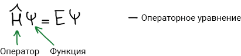
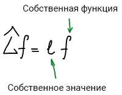
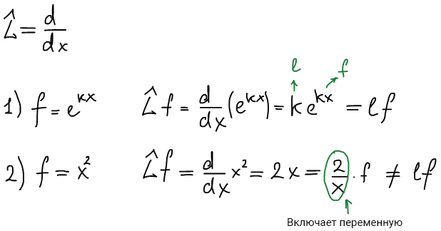
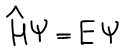

# Операторные уравнения

Функция *f* удовлетворяющая операторному уравнению *Lf = lf* называется **собственной функцией оператора**. Число (не переменная) *l* называется **собственным значением оператора**.

Пример:

Рассмотрим оператор дифференцирования

В первом случае функция f является собственной функцией оператора, собственное значение k. Во втором случае функция f не является собственной, т.к. не соответствует операторному уравнению (l содержит в себе переменную).

Основная задача квантовой химии сводится к нахождению собственных функций и собственных значений оператора полной энергии для молекул.

## Является ли собственная функция единственной для оператора, или у него может быть несколько собственных функций?

Рассмотрим оператор дифференцирования:

Для оператора может существовать различное множество собственных функций. Причем собственные функции самосопряженного оператора ортогональны друг другу и образуют базис пространства функций.

## Пусть есть разные операторы. Будут ли их собственные функции разными или они могут быть одинаковыми?

Если операторы коммутируют друг с другом , то они имеют общую систему собственных функций. Собственные функции коммутирующих операторов одни и те же.

## Всегда ли разным собственным функциям отвечают разные собственные значения?

Рассмотрим оператор дифференцирования:

Собственные волновые функции для которых собственное значения одинаковые называются **вырожденными**.

## Физический смысл собственного значения

Запишем операторное уравнение:

Умножим левую и правую часть равнения на комплексно-сопряженную функцию *f\**:

Проинтегрируем:

Собственное значение есть значение физической величины (из 5 постулата). Т.е. для оператора полной энергии системы (гамильтониана *H*) — собственное значение *Е* есть значение физической величины полной энергии системы.

1 следствие: константа Е в уравнении Шредингера является полной энергией системы.

2 следствие: Для любого состояния системы можно найти его энергию.

## Проблема точных и средних значений физических величин. Энергия известна точно или это вероятностная величина?

Физическая величина определяется интегралом:

1) *Ψ* — собственная, тогда *физическая величина l* — точное значение;

2) *Ψ* — не собственная:

*Ψ* — не собственная:

Физическая величина вычисляемая по 5 постулату является точной, если волновая функция является собственной функцией оператора.

Если волновая функция не является собственной функцией оператора, то физическая является средней.

2 следствия:

* энергия любой системы может быть определена точно (это не средняя величина)

    

* физические величины, соответствующие коммутирующим операторам могут быть одновременно определены с любой степенью точности. И обратное: если операторы не коммутируют, то их физические величины не могут быть одновременно точно определены.

