# Основные операторы квантовой механики

## Оператор координаты

Оператор координаты — просто координата. Его действие на любую функцию заключается в умножении ее на *x*.

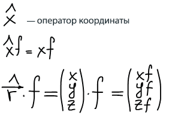

Свойства:

* линейность оператора:

    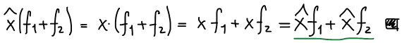

* самосопряженность:

    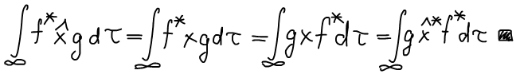

## Оператор импульса

**Оператор импульса** определяется через операторы его проекций. Операторы проекций импульса и координат подчиняются определённым правилам перестановки, которые очень облегчают расчеты с ними.

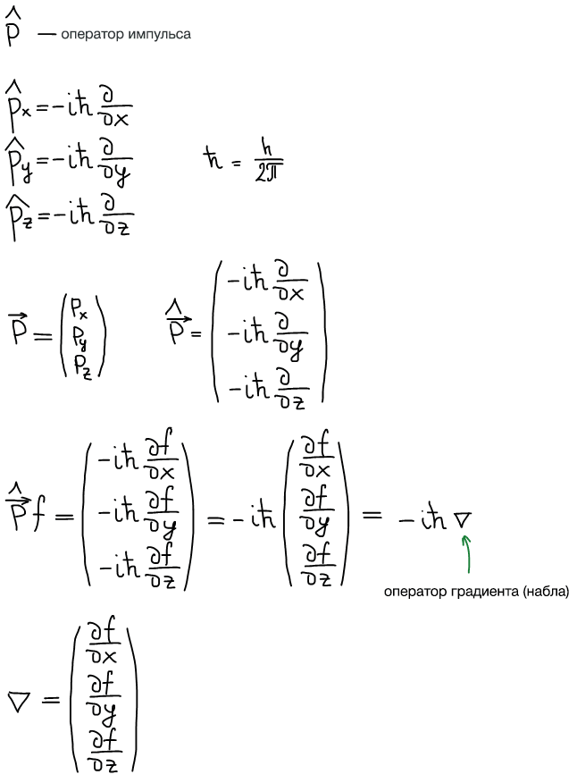

Свойства:

* линейность оператора:

    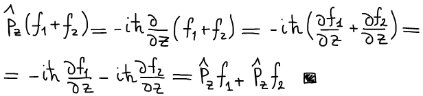

* самосопряженность оператора: 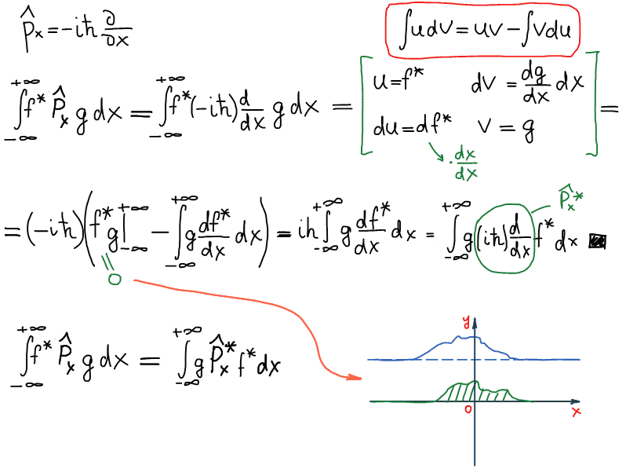

Проверим, коммутируют ли операторы координаты и импульса:

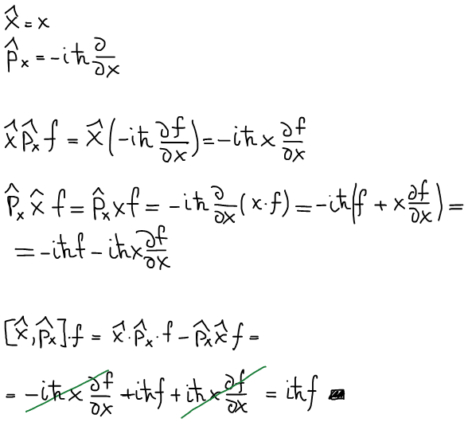

Операторы импульса и координаты **не коммутируют**.

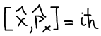

## Оператор кинетической энергии

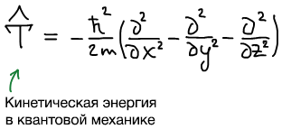

Вывод оператора кинетической энергии:

Чтобы построить оператор, нужно записать классическое выражение для этой величины, а затем выразить через импульсы и координаты.

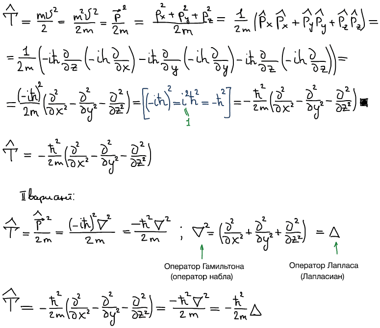

Свойства:

* Линейность: +
* Самосопряженность:

    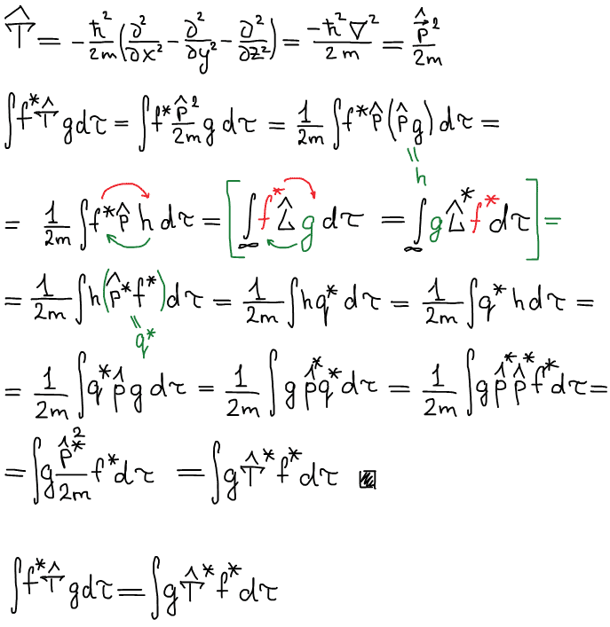

Можем предположить, что операторы импульса и кинетической энергии коммутируют, т.к. порядок дифференцирования не имеет значения.

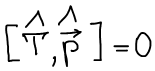

Однако, т.к. оператор импульса и координаты не коммутируют, то оператор кинетической энергии тоже не коммутирует с оператором координаты.

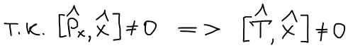

## Оператор потенциальной энергии

Потенциальная энергия электростатического взаимодействия:

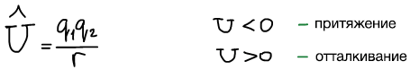

Свойства этого оператора проверяются как для оператора координаты.

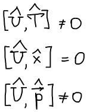

## Оператор полной энергии системы

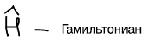

Полная энергия представляет собой сумму кинетической и потенциальной энергий.

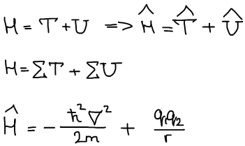

Линейность и самосопряженность вытекает из линейности и сопряженности составляющих.

О коммутации — сложно сказать. Однако в общем случае Гамильтониан не коммутирует ни с одним оператором:

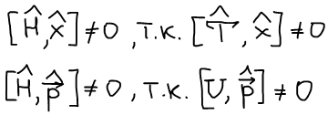 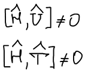

