# Пространство волновых функций

Квантовое состояние — любое возможное состояние, в котором может находиться квантовая система. Квантовое состояние может быть описано:

-   в волновой механике — волновой функцией;
-   в матричной механике — вектором состояния или полным набором квантовых чисел для определённой системы.

**Волновая функция** — комплексная функция, используемая в квантовой механике для описания состояния системы. Является коэффициентом разложения вектора состояния по базису (обычно координатному).

**Признаки волновой функции**: конечность , однозначность, непрерывность, нормированность.

Множество всех функций, удовлетворяющих требованиям первого постулата называется **пространством волновых функций**, т.е. **пространство функций** – это конкретное множество функций. Понятие пространство несет смысл — в нем мы можем задать координаты функции (пространство структурирует объем - x,y,z).

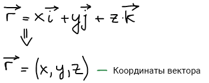

\{ϕi\} — базис функции; Сi — коэффициенты разложения.

Разложение функций в ряды:

-   Ряд Тейлора

    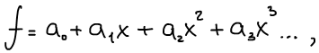

    где x, x2, x3… — базис функции; a0, a1, a2, a3… — координаты функции.

-   Ряд Фурье

    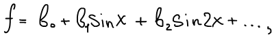

    где sin(kx) — базис функции; b0, b1, b2, b3… — координаты функции.

    Базис нужен, чтобы унифицировать действия функций. Координаты — чтобы мы рассматривали положения с одинаковой точки зрения.

    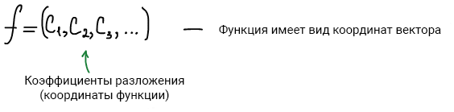

    В пространстве может быть разное множество базисов, соответственно для другого базиса все координаты будут уже другие. Базис задает координаты точек и это может быть любая тройка векторов, даже если между ними не 90°.

Волновые функции называются **ортогональными**, если выполняется следующее равенство:

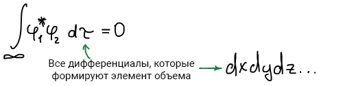

Физический смысл: этот интеграл — есть вероятность перехода системы из функции φ1 в φ2. Эта вероятность равна нулю.

Волновые функции называются **нормированными**, если выполняется следующее равенство:

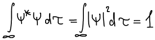

Физический смысл: этот интеграл — есть вероятность нахождения системы во всем пространстве. Эта вероятность равна единице.

Если волновые функции являются *нормированными* и *ортогональными*, то они называются **ортонормированным** базисом функции. Такие базисы являются наиболее удобными.

Выведем условие **ортонормированности**:

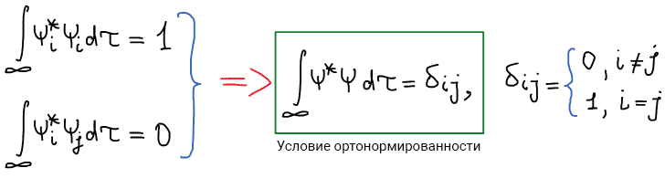

Допустим, есть функция:

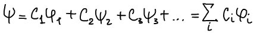

Функция подчиняется условию нормировки:

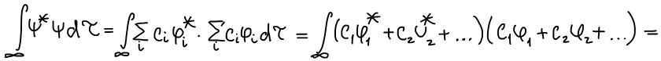 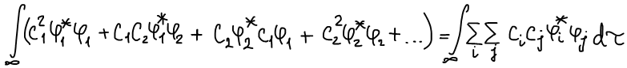

При умножении вводится новый индекс j.

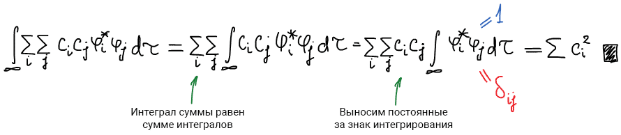

Результат нормировки функции пси по базису:

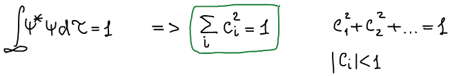

**Физический смысл**: этот интеграл — вероятность нахождения системы около базисной функции.

