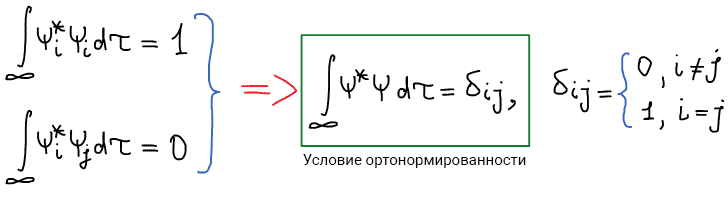
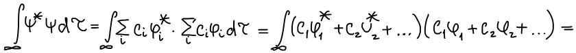
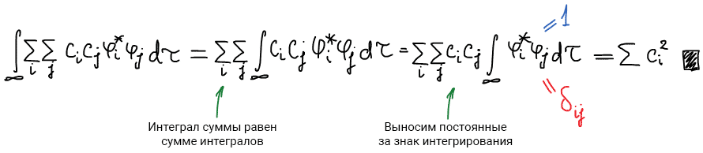
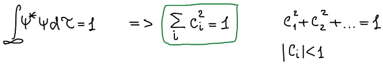

# Пространство волновых функций

Квантовое состояние — любое возможное состояние, в котором может находиться квантовая система. Квантовое состояние может быть описано:

* в волновой механике — волновой функцией;
* в матричной механике — вектором состояния или полным набором квантовых чисел для определённой системы.

**Волновая функция** — комплексная функция, используемая в квантовой механике для описания состояния системы. Является коэффициентом разложения вектора состояния по базису (обычно координатному).

**Признаки волновой функции**: конечность , однозначность, непрерывность, нормированность.

Множество всех функций, удовлетворяющих требованиям первого постулата называется **пространством волновых функций**, т.е. **пространство функций** – это конкретное множество функций. Понятие пространство несет смысл — в нем мы можем задать координаты функции (пространство структурирует объем - $x$,$y$,$z$).

$$
\vec{r} = x\vec{i} + y\vec{j} + z\vec{k}
$$

$$
\vec{r} = (x, y, z) \text{ — координаты вектора}
$$

Разложение функций в ряды:

* Ряд Тейлора

    $$
    f=a_0 + a_1x + a_2x^2 + a_3x^3 + ...,
    $$

    где $x$, $x^2$, $x^3$ — базис функции; $a_0$, $a_1$, $a_2$, $a_3$ — координаты функции.

* Ряд Фурье
    $$
    f = b_0 + b_1\sin{x} + b_2\sin{2x} + ...,
    $$

    где $\sin(kx)$ — базис функции; $b_0$, $b_1$, $b_2$, $b_3$ — координаты функции.

    Базис нужен, чтобы унифицировать действия функций. Координаты — чтобы мы рассматривали положения с одинаковой точки зрения.

    $$
    f = (C_1, C_2, C_3, ...) \text{ — функция имеет вид координат вектора}
    $$

    где $C_1, C_2, C_3$ — коэффициенты разложения (координаты функции)

    В пространстве может быть разное множество базисов, соответственно для другого базиса все координаты будут уже другие. Базис задает координаты точек и это может быть любая тройка векторов, даже если между ними не 90°.

Волновые функции называются **ортогональными**, если выполняется следующее равенство:

$$
\int\limits_{-\infin}^{+\infin} \varphi_1^*\varphi_2d\tau = 0 ,
$$

где $d\tau$ — все дифференциалы, которые формируют элемент объема — $dxdydz$.

Физический смысл: этот интеграл — вероятность перехода системы из функции $\varphi_1$ в $\varphi_2$. Эта вероятность равна нулю.

Волновые функции называются **нормированными**, если выполняется следующее равенство:

$$
\int\limits_{-\infin}^{+\infin} \Psi^*\Psi\tau = \int\limits_{-\infin}^{+\infin} |\Psi|^2 d\tau = 1
$$

Физический смысл: этот интеграл — вероятность нахождения системы во всем пространстве. Эта вероятность равна единице.

Если волновые функции являются *нормированными* и *ортогональными*, то они называются **ортонормированным** базисом функции. Такие базисы являются наиболее удобными.

Выведем условие **ортонормированности**:

Допустим, есть функция:

$$
\Psi = C_1\varphi_1 + C_2\varphi_2 + C_3\varphi_3 + ... = \sum_i{C_i\varphi_i} ,
$$

где $\varphi_i$ — базис функции, $Сi$ — коэффициенты разложения.

Функция подчиняется условию нормировки:

 

При умножении вводится новый индекс j.

Результат нормировки функции пси по базису:

**Физический смысл**: этот интеграл — вероятность нахождения системы около базисной функции.

