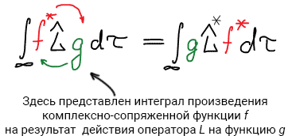
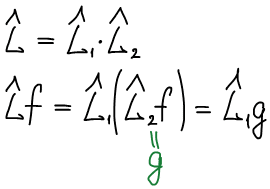
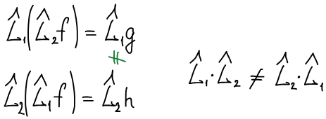
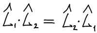
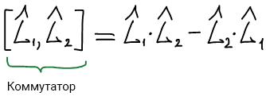

# Свойства операторов

**Оператор** — это закон, по которому одной функции $f$ ставится в соответствие другая функция $g$. Оператор определяет, какое действие должно быть произведено над функцией $f$, чтобы перевести ее в функцию $g$:

$$
g = \widehat{L}f
$$

**Свойства операторов**:

1. **Линейность.** Оператор называется линейным, если выполняется следующее равенство:

    $$
    \widehat{L}(\alpha_1f_1 + \alpha_2f_2) = \alpha_1\widehat{L}f_1 + \alpha_2\widehat{L}f_2
    $$

    $$
    \widehat{L}(f_1 + f_2) = \widehat{L}f_1 + \widehat{L}f_2
    $$

    $$
    \widehat{L}(f_1 + f_1) = \widehat{L}f_1 + \widehat{L}f_1 = 2 \widehat{L}f_1
    $$

2. **Самосопряженность.** Оператор называется самосопряженным (эрмитовым), если выполняется следующее равенство:

    

Над операторами можно производить действия:

* сложение:

    $$
    \widehat{L} = \widehat{L}_1 + \widehat{L}_2
    $$

    $$
    \widehat{L}f = (\widehat{L}_1 + \widehat{L}_2)f = \widehat{L}_1f + \widehat{L}_2f
    $$

    При сложении порядок действия операторов **не имеет значения**:

    $$
    \widehat{L}_1f + \widehat{L}_2f = \widehat{L}_2f + \widehat{L}_1f
    $$

* умножение:

    

    При умножении порядок действия операторов **имеет значение**:

    

    Однако, существуют такие пары операторов, для которых перестановочный закон умножения выполняется. Такие пары операторов называются **коммутирующими** (операторы коммутируют друг с другом).

    **Условие коммутации:**

    

    В случае, если операторы не коммутируют друг с другом, то для таких функций существует коммутатор.

    **Коммутатором** называется оператор, построенный следующим образом:

    

    Для коммутирующих операторов коммутатор равен нулю.

