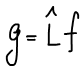
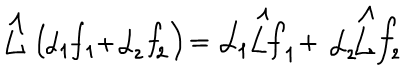
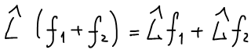
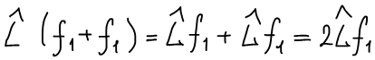
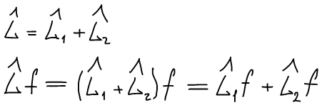
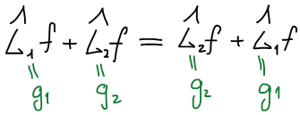

# Свойства операторов

**Оператор** — это закон, по которому одной функции f ставится в соответствие другая функция g. Оператор определяет, какое действие должно быть произведено над функцией f, чтобы перевести ее в функцию g:

**Свойства операторов**:

1. **Линейность.** Оператор называется линейным, если выполняется следующее равенство:

    

    

    

2. **Самосопряженность.** Оператор называется самосопряженным (эрмитовым), если выполняется следующее равенство:

    

Над операторами можно производить действия:

* сложение:

    

    При сложении порядок действия операторов **не имеет значения**:

    

* умножение:

    

    При умножении порядок действия операторов **имеет значение**:

    

    Однако, существуют такие пары операторов, для которых перестановочный закон умножения выполняется. Такие пары операторов называются **коммутирующими** (операторы коммутируют друг с другом).

    **Условие коммутации:**

    

    В случае, если операторы не коммутируют друг с другом, то для таких функций существует коммутатор.

    **Коммутатором** называется оператор, построенный следующим образом:

    

    Для коммутирующих операторов коммутатор равен нулю.

