# Анионная полимеризация: основные катализаторы, механизм и кинетика

**Анионная полимеризация** — это процесс образования макромолекул, в котором активные центры несут отрицательный заряд.

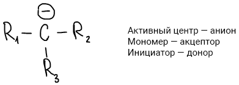

## Катализаторы анионной полимеризации

1.  Щелочные металлы.
2.  Амиды щелочных металлов

    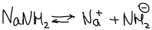

3.  Na- и Li-органические соединения, н-р: Na-нафталиновый комплекс.

    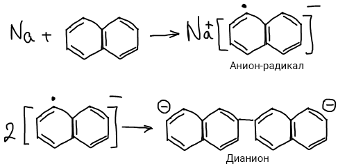

4.  Алкоголяты

    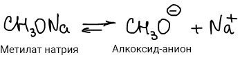

## Механизм анионной полимеризации

Анионная полимеризация характерна для винильных соединений с электроноакцепторными заместителями: акрилонитрила, алкилакрилатов, стирола и др.

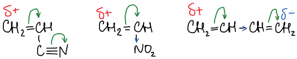

### Основные стадии:

1.  Инициирование

    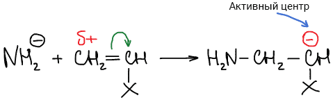

    Причем "Х" — не галоген. Галогензамещенные винилы не вступают в такую реакцию, они малоактивны (ПВХ получают по радикальному механизму).

2.  Рост цепи

    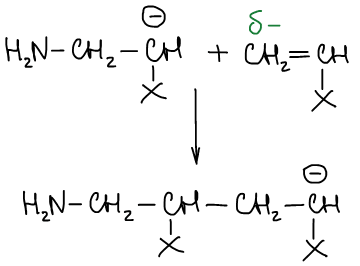

3.  Реакция обрыва цепи (протекает с участием растворителя, например аммиаком)

    

По анионному механизму полимеризуются также циклические мономеры, н-р получение этиленоксида:

1.  Инициирование

    

2.  Рост цепи

    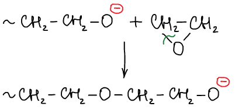

3.  Обрыв цепи

    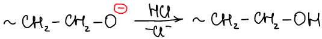

## Кинетика анионной полимеризации:

### I. Влияние концентрации исходных веществ на скорость реакции роста цепи

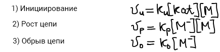

По принципу стационарности:

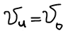

Тогда:

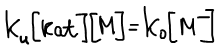

Выразим отсюда концентрацию макроиона:

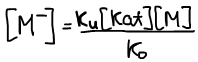

Подставим уравнение концентрации макроиона в уравнение скорости реакции роста цепи:

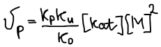

### II. Влияние концентрации исходных веществ на степень полимеризации.

 Степень полимеризации равна отношению скоростей роста и обрыва цепи:

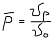

Подставим уравнения скоростей:

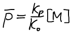

Следует заметить, что степень полимеризации не зависит от концентрации катализатора.

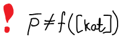

### Особенности анионной полимеризации:

Уравнение Аррениуса:

Наибольшую энергию активации имеет реакция обрыва, значит при низких температурах обрыва не будет

В системе будет существовать макроанион, который называют "живой" цепью, т.к. этот макро-анион может инициировать реакцию полимеризации другого мономера. Так получаю блок-сополимеры.

Анионная полимеризация используется для получения полимеров узкого молекулярно-массового распределения (цепочки одной длины)

