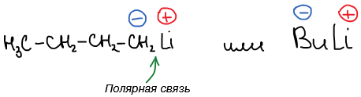
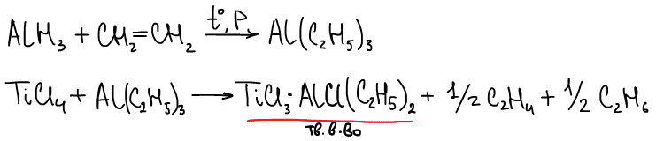
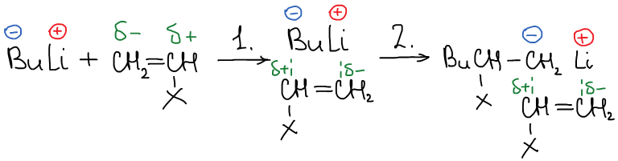
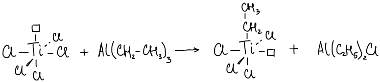
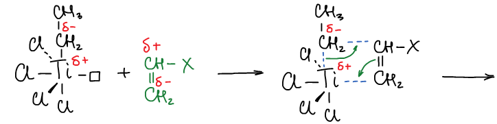
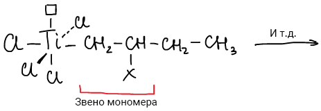
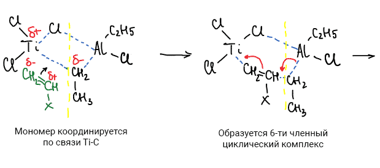
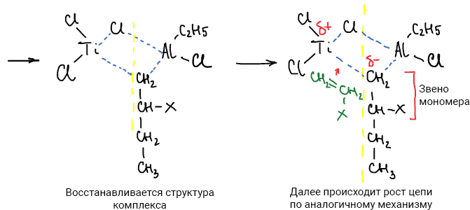

# Анионно-координационная полимеризация

Анионно-координационная полимеризация используется для получения стереорегулярных полимеров. Катализатор в таких реакциях выполняет роль матрицы, на которой строится полимерная цепь. Это позволяет контролировать процесс в большей степени, чем в других видах полимеризации.

## Катализаторы аниооно-координационной полимеризации

1.  Li- и K-органические соединения, например: бутиллитий (Bu-Li)

    

2.  Катализаторы Циглера-Натта

    Катализаторы Циглера-Натта представляют собой комплексы галогенидов переходных металлов с металлорганическими соединениями: TiCl4 + AlCl(C2H5)2. В 1963 году К. Циглер и Дж. Натт, получили Нобелевскую премию за открытие этого катализатора.

    Способ получения катализатора:

    

## Механизм анионно-координационной полимеризации

### Механизм реакции с бутиллитием

Механизм анионно-координационной полимеризации с использованием бутиллития в качестве катализатора выглядит следующим образом:

1. Происходит ориентация молекулы мономера относительно поляризованной связи.

2. Внедрение (встраивание) молекулы мономера относительно поляризованной связи.

Получившиеся полимеры стереорегулярны.

### Механизм реакции с катализатором Циглера-Натта

Предложено два основных механизма протекания полимеризации: **монометаллический** и **биметаллический**. Биметаллический предполагает участие обоих металлов, а монометаллический — только переходного.

#### Монометаллический механизм (схема Косси-Арлмана)

Стадия 1. Алкилирование переходного металла:

Стадия 2. Инициирование и рост цепи:

#### Биметаллический механизм (активный центр - комплекс)

