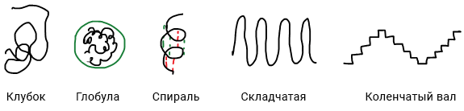

# Гибкость цепи полимера

**Струкутура** — способ расположения структурных элементов в системе и характер связи между ними. Структурные элементы: атомы, звенья, молекулы.

**Ближний порядок** — упорядоченность структуры элементов, которая сохраняется на расстоянии, соизмеримом с размерами данных элементов.

**Дальний порядок** — упорядоченность структуры элементов, которая сохраняется на расстоянии гораздо больших, чем размеры данных элементов.

**Конфигурация** — пространственное распределение атомов и молекул в цепи, определяемое природой химических связей, их длиной и валентными углами. Конфигурация не изменяется при тепловых движениях звеньев.

Конфигурационные уровни полимеров:

* конфигурация звена (цис-, транс-);
* конфигурация присоединения звеньев Г-Г, Г-Х, Х-Х (ближний порядок);
* тактичность цепи (синдио-, изо-, а-);
* конфигурация присоединения блоков (дальний порядок — блок- и привитые сополимеры);
* конфигурация цепи (линейная, разветвленная, сетчатая и т.п.).

**Конформация** — пространственная форма макромолекулы, обусловленная тепловым движением звеньев, их взаимодействием между собой и молекулами растворителя. Переход одной конформации в другую осущетсвляется без разрыва химической связи.

**Гибкость цепи** — способность изменять свою форму под влиянием тепловых движений звеньев или внешнего поля (механического, электрического, магнитного). Гибкость связана с внутренним вращением частей мономеров.

**Внутреннее вращение** — вращение одной части молекулы относительно другой. Вращение фрагментов молекулы относительно друг друга вдоль соединяющей их связи обуславливает возникновение различных конформаций молекулы, характеризуемых определенными значениями потенциальных энергий.

Рассмотрим внутреннее вращение в молекуле этана:

При повороте группы CH3 вокруг линии, соединяющей атомы углерода изменяется потенциальная энергия, т.е. U=f(φ), где φ — угол поворота.

Зависимость потенциальной энергии молекулы этана от угла поворота:

**Потенциальный барьер вращения** — энергия, необходимая для перехода молекулы из положения с минимальной энергией в положение с максимальной.

Наличие потенциального барьера приводит к тому, что вращение групп в молекулах становится неравномерным. Переход из Umin в Umax возможно только в том случае, когда кинетическая энергия молекулы превышает потенциальный барьер. При небольшом запасе кинетической энергии молекулы колеблются относительно положения с минимальным значением энергии. Это явление заторможенного (ограниченного) внутреннего вращения.

Рассмотрим вращение в молекуле н-бутана:

Зависимость потенциальной энергии молекулы н-бутана от угла поворота:

