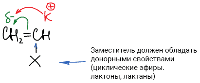

# Катионная полимеризация: основные катализаторы, механизм и кинетика

**Катионная полимеризация** — процесс образования макромолекул, в котором активные центры несут положительный заряд, а инициатор является источником положительного заряда.

## Катализаторы катионной полимеризации

1. Протонные кислоты

    

2. Апротонные кислоты (кислоты Льюиса – акцепторы электронной пары)

    

    Однако для инициирования апротонными кислотами необходимы сокатализторы:

    

### Механизм образования катализатора

## Механизм катионной полимеризации

Катионная полимеризация характерна *для винильных соединений с электронодонорными заместителями*: изобутилена, бутилвинилового эфира, α-метилстирола и др.

Изобутилен полимеризуется только по катионному механизму:

### Стадии катионной полимеризации

1. Инициирование:

    

2. Рост цепи:

    

3. Реакция обрыва цепи (каждая реакция обрыва протекает по своему механизму
    * Возможно прекращение роста цепи за счет присоединении к карбониевому макроиону отрицательного иона катализатора:

        

    * Однако чаще всего прекращение роста цепи связано с отрывом отрицательным ионом катализатора водорода от полимерной цепи:

        

4. Побочные реакции:

    

    

## Кинетика катионной полимеризации

### I. Влияние концентрации исходных веществ на скорость реакции роста цепи

По принципу стационарности:

Тогда:

Выразим отсюда концентрацию макроиона:

Подставим в уравнение скорости реакции роста цепи:

### II. Влияние концентрации исходных веществ на степень полимеризации.

**Степень полимеризации** равна отношению скоростей роста и обрыва цепи:

Подставим уравнения скоростей:

Следует заметить, что степень полимеризации не зависит от концентрации катализатора.

