# Классификация полимеров

1.  [Классификация по составу](#po-sostavu)
2.  [Классификация по химическому составу](#po-himicheskomy-sostavy)
3.  [Классификация по структуре макромолекулы](#po-structure)
4.  [Классификация по пространственному строению](#po-prostransvennomy-stroeniyu)
5.  [Классификация по классам соединений](#po-klassam-soedinenii)
6.  [Классификация по регулярности строения](#po-regularnosti-stroenia)

## Классификация по составу

По составу полимеры делятся на:

-   Органические \(полиэтилен и др.\);
-   Элементорганические \(полидиметилсилоксан и др.\);
-   Неорганические полимерные \(олово, селен, теллур, аморфная сера, черный фосфор, кварц, корунд, алюмосиликаты, полифосфаты\).

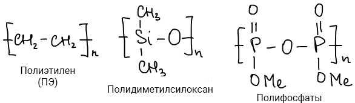

## Классификация по химическому составу

По составу полимеры делятся на:

-   **Гомоцепные** \(главная цепь состоит из атомов одной природы, например: полиэтилен, поливинилхлорид и др.\);
-   **Гетероцепные** \(встречаются несколько атомов различной природы, н-р: полиэтиленоксид и др.\);
-   **Гомополимеры** \(макромолекулы содержат одинаковые структурные звенья -\[-А-\]-n\);
-   **Гетерополимеры** \(состоят из разных остатков мономеров\). Такие полимеры называют также сополимеры. Различают сополимеры *статистические* \(беспорядочно чередующиеся звенья\), *привитые* \(главная цепь - из одного мономера, а боковые цепи - длинные цепочки из другого мономера\) и *блоксополимеры* \(состоят из блоков макроцепей\).

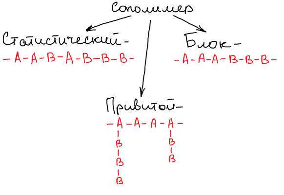

## Классификация по структуре макромолекулы

По структуре макромолекулы полимеры делятся на:

-   **Линейные** \(высокоэластичные\) В макромолекулах линейных полимеров структурные звенья последовательно соединены друг с другом в длинные цепи. Цепи изгибаются в различных направлениях или сворачиваются клубком. Именно эта особенность строения придает эластичность полимерам. Из природных полимеров линейное строение имеют целлюлоза, амилоза \(составная часть крахмала\) натуральный каучук, а из синтетических – полиэтилен низкого давления, капрон, найлон и многие другие полимеры.

    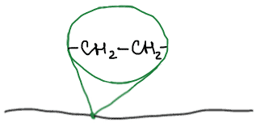

-   **Разветвленные** Макромолекулы разветвленных полимеров – это длинные цепи с короткими боковыми ответвлениями. Такое строение имеют, например полиэтилен высокого давления, амилопектин \(компонент крахмала\).

    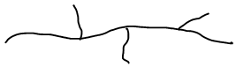

-   **Сетчатые** \(низкоэластичные\) Макромолекулы сетчатых полимеров представляют собой длинные цепи, связанные \(сшитые\) поперечными связями. Такая макромолекула имеет три измерения в пространстве. Высокомолекулярными соединениями с пространственной структурой являются: шерсть, фенолформальдегидные полимеры, резина.

    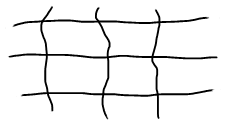

## Классификация по пространственному строению

По пространственному строению полимеры делятся на:

-   Стереорегулярные \(или **изотактические**\). **Изотактический полимер** – полимер, в котором заместители расположены в пространстве по одну сторону от основной полимерной цепи. Стереорегулярность полимера определяет высокие прочностные свойства;

    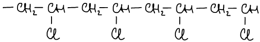

-   **Синдиотактические**. **Синдиотактический полимер** – полимер, в котором заместители расположены по одну и другую сторону от основной полимерной цепи периодически;

    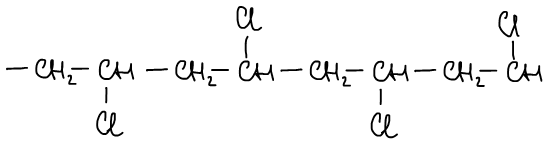

-   Нестереорегулярные \(или **атактические**\). **Атактический полимер** – полимер, в котором заместители расположены беспорядочно \(по одну и по другую сторону от основной полимерной цепи\). Представляет собой более мягкий материал, напоминающий каучук.

    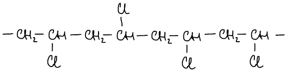

## Классификация по классам соединений

По классам соединений полимеры делятся на:

-   Полиолефины — полимеры, образованные из олефинов \(алкенов\). Пример:

    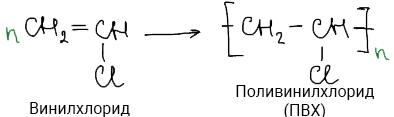

-   Полидиены — полимеры, образованные из алкадиенов. Пример:

    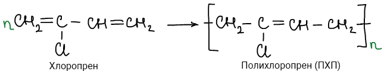

-   Полиэфиры \(простые и сложные\). Примеры:
-   1.  простой:

    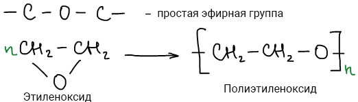

2.  сложный:

    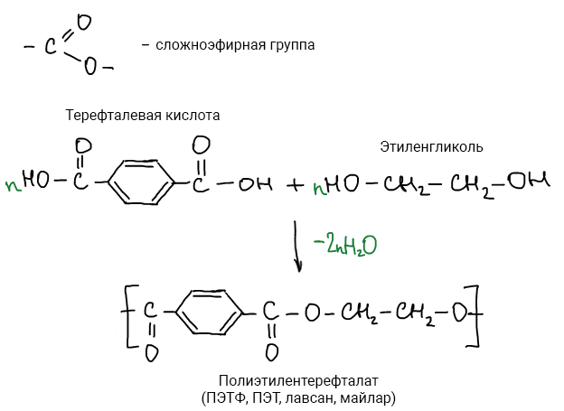

-   **Полиамиды.** Пример:

    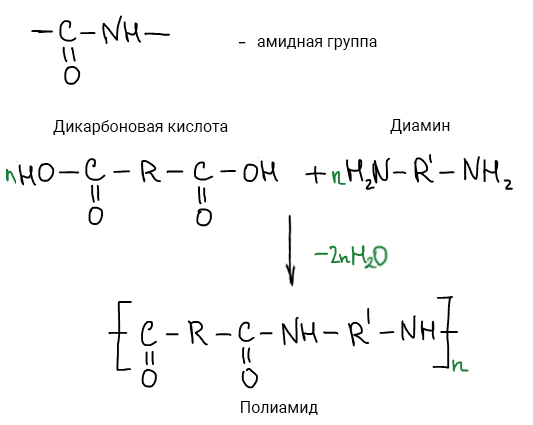

-   **Поликарбонаты.** Пример:

    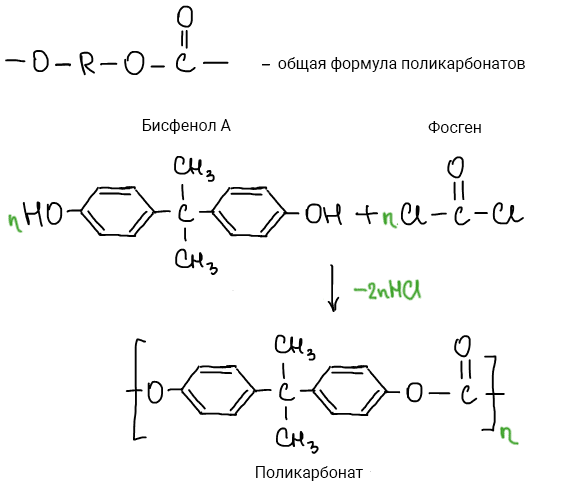

-   **Полиуретаны.** Пример:

    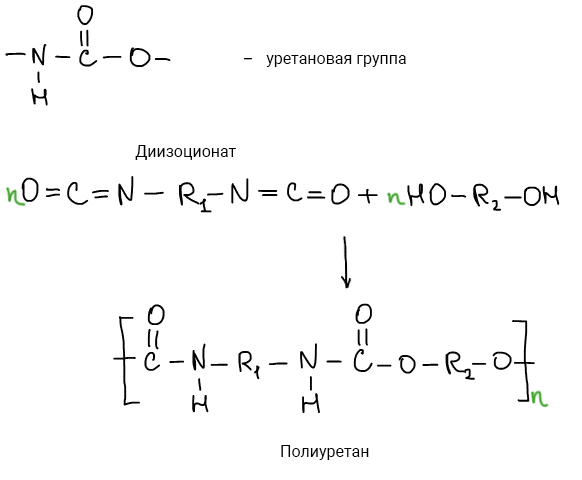

-   **Полисилоксаны \(силиконы\).** Пример:

    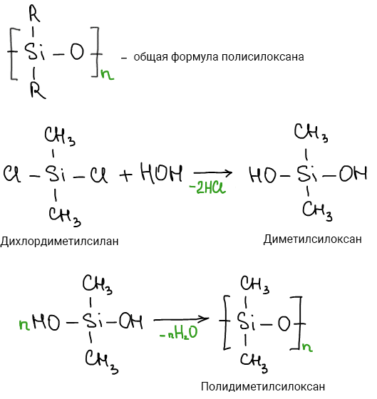

## Классификация по регулярности строения

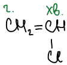

Так как поливинилхлорид не симметричный \(есть голова и есть хвост\) — возможны следующие присоединения: г-г, г-хв, хв-хв. Это вызывает нерегулярность строения получаемого полимера.

Другой пример — хлоропрен. Здесь уже возможны присоединения 1-4, 1-2, 3-4.

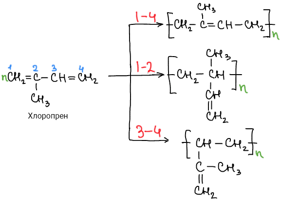

Если есть двойная связь, то возможна цис- и транс-изомерия. Пример:

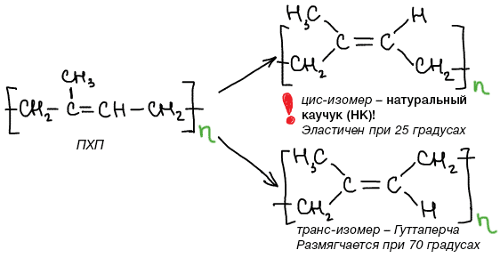

