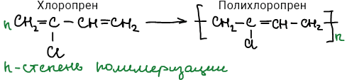
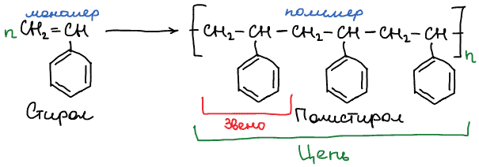
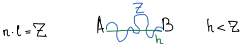

# Основные определения химии ВМС

Определения расположены в алфавитном порядке.

## Внутримолекулярные превращения

Химические реакции функциональных групп основной цепи, приводящие к изменению её строения. Внутримолекулярные превращения происходят под действием тепла, света и химических реагентов. Подробнее в разделе [Внутримолекулярные превращения](vnutrimolekulyarnye-prevrashcheniya.md).

## Волокна

Высокомолекулярные соединения, имеющие линейное строение и сформированные в виде нитей.

## Высокомолекулярные соединения

Вещества с очень большими значениями молекулярных масс ($M > 10^6$ г/моль).

## Вулканизация

Технологический процесс получения резин и каучуков за счет соединения линейных макромолекул в сетку. Подробнее в разделе [Реакции сшивания](reakcii-sshivaniya.md#).

## Каучуки

Продукты полимеризации алкадиенов и их производных.

## Макромолекула

Молекула высокомолеклярного соединения.

## Мономеры

Молекулы, из которых получаются макромолекулы ВМС.

## Олигомер

Соединение с небольшой молекулярной массой: средней между массой мономерама и полимера.

## Пластмассы

Высокомолекулярные соединения, в состав которых входят вещества улучшающие физические свойства полимера: *стабилизаторы* (повышают стойкость к свету), *пластификаторы* (улучшают эластичность, морозостойкость, огнестойкость), *красители.*

## Поликонденсация

Процесс получения ВМС из низкомолекулярных соединений с выделением побочных продуктов. Процесс осуществляется за счет *реакции функциональных групп* (-OH, -COOH, -NH2 и др.) и отщепления низкомолекулярных побочных продуктов. Продукты поликонденсации по элементному составу не соответствуют исходным мономерам.

## Полимер

Высокомолекулярное соединение, построенное из повторяющихся звеньев одного типа.

## Полимераналогичные превращения

Химические реакции макромолекул с низкомолекулярными соединениями, в процессе которых изменяется природа функциональных групп полимера, но сохраняется длина и строение скелета основной цепи. Подробнее в разделе [Полимераналогичные поревращения](polimeranalogichnye-prevrashcheniya.md).

## Полимеризация

Процесс получения ВМС из низкомолекулярных соединений без выделения побочных продуктов. Данный процесс осуществляется за счет кратных связей (С=С, С=О и др.) или раскрытия циклов, содержащих гетероатомы (N, S, O). Продукты полимеризации имеют тот же элементный состав, что и исходные мономеры.

## Радикальная полимеризация

Процесс получения ВМС из низкомолекулярных соединений без выделения побочных продуктов, где активный центр — свободно-радикальная частица (частица с неспаренным электроном).

## Реакции сшивания

Реакции, приводящие к росту молекулярной массы цепи: [вулканизация](reakcii-sshivaniya.md#) и [отверждение](reakcii-sshivaniya.md#).

## Реакция деструкции

Реакции, приводящие к разрыву химической связи в макромолекулах. Вследствие чего возможно уменьшение степени полимеризации и молекулярной массы полимера. Подробнее в разделе [Реакция деструкции](reakcii-destrukcii.md).

## Сополимер

Высокомолекулярное соединение, построенное из воторяющихся звеньев нескольких типов.

## Степень полимеризации

Число мономерных звеньев в макромолекуле:

## Струкутура

Способ расположения структурных элементов в системе и характер связи между ними. Структурные элементы: атомы, звенья, молекулы.

## Термопласты

Полимеры, которые при эксплуатации находятся в твердом состоянии, при повышении температуры — размягчаются, а при понижении — вновь возвращаются в прежнее состояние. Таким полимером является [полиэтилентерефталат](vazhnejshie-polimery.md#petf).

## Термореактопласты

Полимеры, которые при повышении температуры не размягчаются (фенолформальдегидные смолы, эпоксидные смолы, Si-органические полимеры).

## Цепь полимера

Повторяющаяся группа звеньев:

Цепь полимера в нормальных условиях находится в свернутом состоянии. Так, что длина цепи всегда больше кратчайшего растояния между началом $А$ и концом $B$ цепи:

где $Z$ — длина цепи, $n$ — число веньев, $l$ — длина звена, $h$ — кратчайшее растояние между началом и концом цепи.
