# Поликонденсация

**Поликонденсация** — ступенчатый процесс образования полимеров, который осуществляется за счет реакции функциональных групп и образования низкомолекулярных побочных продуктов, например: воды, аммония, кислоты.

## Механизм реакции поликонденсации

В реакцию поликонденсации вступают соединения с двумя и более функциональными группами. Функциональные группы могут быть гидроксильные (–OH), карбоксильные (–COOH), аминогруппы (–NH2) и т. д. Если мономер содержит две функциональные группы — образуется линейный полимер, если три и более — трехмерный полимер.

Для наглядности рассмотрим механизм образования связи и самого полимера на примере реакции полиэтерификации:

Полиэтерификация — реакция получения полиэфира, которая заключается в поликонденсации многоатомного спирта и многоосновной кислоты.

В общем случае реакцию полиэтерификации можно представить как огромную последовательность реакций этерификации. Реакция полиэтерификации может происходить с использованием и без использования катализатора. В случае, если катализатор не используется — происходит автокатализ.

### Образование связи (этерификация)

Реакция этерификации (реакция Фишера-Шпайера, 1895 г.) — реакция спирта с карбоновой кислотой, которая приводит к образованию сложного эфира. В качестве катализаторов реакции используют сильные кислоты.

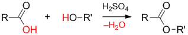

Механизм реакции этерификации:

1. Образование гидроксониевого иона:

    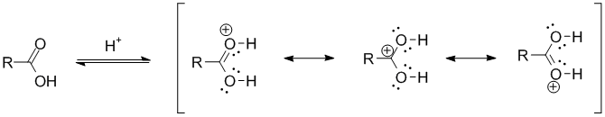

2. Нуклеофильное присоединение молекулы спирта к карбонильному атому углерода:

    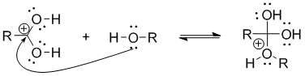

3. Изомеризация (депротонирование-протонирование) образовавшегося аддукта:

    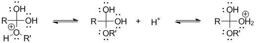

4. Элиминирование молекулы воды:

    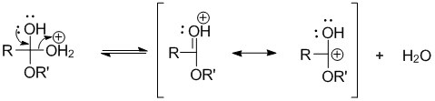

5. Депротонирование продукта реакции:

    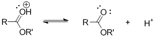

Нуклеофильное присоединение молекулы спирта было доказано с помощью изотопа О18.

### Образование полимера

На первом этапе происходит образование димера в результате последовательных реакций этерификаций . Сначала образуется сложный эфир:

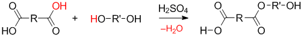

Затем этот эфир может взаимодействовать с таким же сложным эфиром или с исходными мономерами:

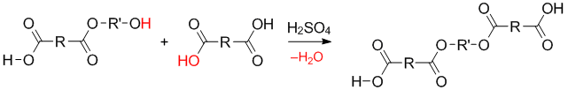

В результате происходит образование димера:

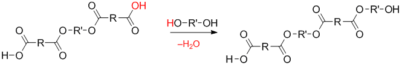

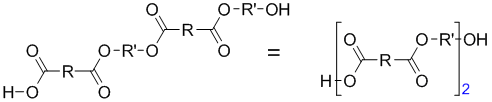

Полученный димер может дальше взаимодействовать с исходными мономерами, димерами или n-мерами. Например, реакция димера с димером приводит к образованию тетрамера:

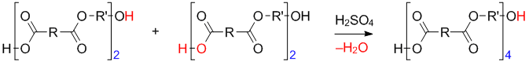

Таким образом, в процессе поликонденсации возможно взаимодействие мономеров друг с другом, мономеров с n-мерами и n-меров с n-мерами. Процесс образования полимера протекает ступенями, растущая цепь после каждой ступени остается устойчивым соединением, молекулярная масса нарастает постепенно.

## Примеры реакций

### Полиэтерификация (получение полиэфиров)

Полиэфиры (или полиэстры) — полимеры, получаемые реакцией поликонденсации многоосновных кислот и многооатомных спиртов. Пример реакции получения полиэтилентерефталата (ПЭТФ):

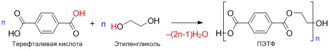

**Примечание.** Полиэфиры также называют полиэстрами (от англ. ester — "эфир").

### Поликонденсация фенола

Реакция поликонденсации фенола с формальдегидом происходит с образованием фенолформальдегидных смол:

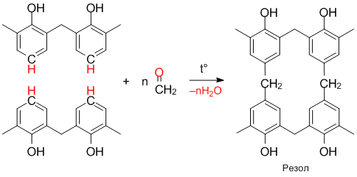

### Получение поликарбоната

Общая формула поликарбонатов:

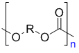

Реакция получения поликарбонатов

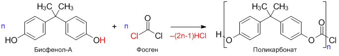

### Получение полиамидов

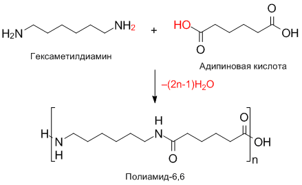

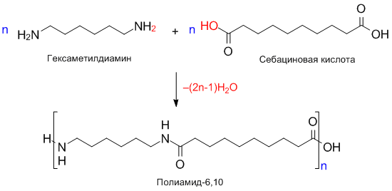

Также к реакциям поликонденсации относят реакцию получения полиамида-6 (капрон, найлон-6):

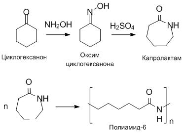

### Получение диметилсилоксана (силиконы)

Общая формула полисилоксана:

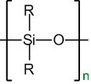

Дихлорметилсилан. Первая ступень протекает с образованием диметилсилоксана. Затем

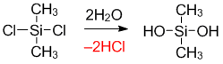

Образование полидиметилсилоксана:

## Поликонденсационные равновесия

Рассмотрим влияние константы равновесия на предельно достижимый выход и молекулярную массу полимера на примере реакции полиэтерификации:

Запишем ее в упрощенном виде:

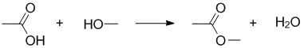

Рассмотрим влияние константы равновесия на глубину протекания реакции:

![K=[−COO−][H2O]/[−COOH][−OH]](../images/vms/polikondensaciya/konstanta-ravnovesiya-reakcii-ehterrifikacii.png)

Глубина протекания реакции характеризуется степенью завершенности реакции Х:

![X=([M_0 ]−[M])/[M_0 ] =1−[M]/[M_0 ]](../images/vms/polikondensaciya/stepen-zavershennosti-reakcii-vtoroe.png)

, где \[M0\], \[M\] — исходная и текущая концентрации мономеров соответственно.

![K=[−COO−]["H" _2 "O" ]/[−COOH][−OH] =(X[M_0 ])^2/([M_0 ]−X[M_0 ])^2 =X^2/(1−X)^2](../images/vms/polikondensaciya/konstanta-ravnovesiya-reakcii-ehterrifikacii-vtoroe.png)

Выразим Х:

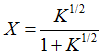

В отсутствие реакции ограничения роста цепи:

![p ̅=[M_0 ]/[M] =1/(1−x)](../images/vms/polikondensaciya/stepen-zavershennosti-reakcii-pervoe.png)

Полученное уравнение называется уравнением Карозерса:

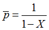

Оно иллюстрирует зависимость средней степени полимеризации от степени завершенности реакции (*X*).

Подставим в уравнение Карозерса выведенное уравнение X:

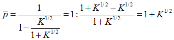

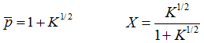

Полученные уравнения позволяют оценить предельно достижимый выход и молекулярную массу при поликонденсации исходя из константы равновесия реакции. Из расчетов установлено, что равновесная поликонденсация может считаться необратимой и использоваться для синтеза полимеров при К \> 103–104.

Однако на практике ни одна из наиболее часто используемых реакций не обладает такой константой равновесия. Поэтому для смещения равновесия необходимо организовывать отвод продуктов. Чаще всего из зоны реакции удаляют низкомолекулярный продукт, реже полимер. Вода и подобные ей низкомолекулярные продукты удаляются отгонкой при атмосферном давлении, менее летучие продукты — отгонкой под вакуумом. Таким образом реакция протекает в неравновесном режиме.

### Влияние избытка одного из мономеров

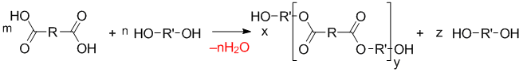

При избытке одного из исходных мономеров на концах макромолекулы образуются одинаковые функциональные группы и рост цепи прекращается. Поэтому соотношение исходных компонентов должно быть 1:1.

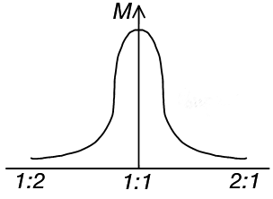

Поликонденсация в большинстве случаев состоит во взаимодействии двух различных функциональных групп. Если в систему внести монофункциональное соединение, способное вступать во взаимодействие с одной из функциональных групп, участвующих в поликонденсации, то оно блокирует эти группы и прекращает процесс поликонденсации. Величина степени поликонденсации определяется молекулярным соотношением бифункционального и монофункционального соединения (это правило называют правилом Коршака):

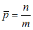

где *n* — число молей бифункционального соединения, *m* — монофункционального.

## Трехмерная поликонденсация

При совместной поликонденсации мономеров с тремя и более функциональными группами образуются сшитые трехмерные полимеры. Особенностью таких реакция является то, что на глубоких стадиях реакции при поликондесации теряется текучесть реакционной массы.

На первой стадии реакции, когда образуются линейные и разветвленные олигомеры, реакционная система сохраняет текучесть. На глубоких стадиях, когда образуется сшитый полимер — текучесть реакционной массы теряется. Эта важная технологическая особенность трехмерной поликонденсации приводит к необходимости совмещать заключительную стадию реакции с формированием товарного изделия (литьем в формы). Получаемые таким образом сшитые полимеры называют **термореактивными** или **термореактопластами**.

Степень завершенности реакции, при которой происходит образование нетекучего геля вследствие образования трехмерной сетки называется **точкой гелеобразования Хг.**  Из изложенного выше ясно, как важно знать **Хг** конкретной системы. Метод расчета точки гелеобразования впервые разработал Карозерс. Этот метод сводится к нахождению степени завершенности реакции, при которой степень полимеризации стремится к бесконечности. Карозерс ввел понятие средней функциональности мономеров:

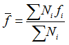

где *Ni*– число молекул мономера с функциональность *fi*, ∑*Ni* – общее число молекул мономеров, ∑*Nifi* – общее число функциональных групп, участвующих в поликонденсации. Оказалось, что Хг связана с *fср* простой зависимостью:

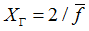

Рассмотрим пример поликонденсации глицерина и терефталевой кислоты.

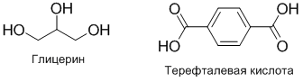

В глицерине 3 гидроксильных групп (*f1*=3), в терефталевой кислоте — 2 (*f2*=2). Следовательно, чтобы отношение функциональных групп было 1:1 необходимо взять 2 моль глицерина и 3 моль терефталевой кислоты. Тогда на 5 молекул реагентов приходится 12 функциональных групп. Средняя функциональность мономеров будет равна:

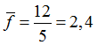

Тогда точка гелеобразования будет равна:

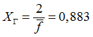

## Способы проведения поликонденсации

### Поликонденсация в расплаве

**Достоинства**: можно получить высокомолекулярный полимер с высокой скоростью в отсутствие растворителя.

**Недостатки**: необходимость получения расплава полимера, что затруднительно и невозможно для высокоплавких полимеров (начинается разложение).

**Получают**: Полиамиды, полиэфиры

Проведение поликонденсации в расплаве является наиболее разработанным и  распространенным промышленным способом синтеза поликонденсационных  полимеров. Реакцию проводят при температуре на 10-20°С выше температуры плавления  синтезируемого полимера (обычно при 200-300°С). Сначала в атмосфере инертного газа и  на конечных стадиях в вакууме для более полного удаления побочных продуктов из  сферы реакции. Процесс может быть периодическим или непрерывным. К достоинствам  способа поликонденсации в расплаве относится простота технологической схемы и  высокое качество получаемого полимера. Однако необходимость работы при высокой  температуре и создания вакуума усложняет аппаратурное оформление технологического  процесса.

### Поликонденсация в растворе

Меньшие скорости, трудность удаления низкомолекулярных продуктов.

Способ проведения поликонденсации в растворе также широко распространен в  промышленности, особенно при получении высокоплавких полимеров.  Поликонденсацию осуществляют в одном растворителе или в смеси растворителей.  Низкомолекулярный побочный продукт удаляется либо путем химического  взаимодействия с растворителем, либо отгонкой с парами растворителя.

Поликонденсация в растворе имеет некоторые технологические преимущества перед другими способами поликонденсации. Она проводится в более мягких температурных условиях, позволяет исключить местные перегревы за счет более интенсивного теплообмена, не требует применения вакуума и инертного газа, а следовательно, сложной аппаратуры. Однако синтез полимеров этим способом связан с необходимостью проведения таких операций, как приготовление растворов мономеров, регенерация растворителя, промывка полимера, его фильтрация, сушка и т. п.

Поликонденсацию в расплаве и в растворе можно ускорить введением катализаторов.  Например, при синтезе фенолформальдегидных олигомеров в качестве катализаторов  используют органические и минеральные кислоты или основания.

### Поликонденсация в эмульсии

Поликонденсация в эмульсии пока не нашла широкого применения. Ее осуществляют  главным образом в тех случаях, когда оба мономера нерастворимы в воде. Реакция  поликонденсации идет в стабилизированных каплях мономерной смеси, из которых в  водную фазу уходит, растворяясь в ней, низкомолекулярный побочный продукт.

### Поликонденсация на границе раздела фаз

Отпадает необходимость соблюдения стехиометрического соотношения, т. к. подача компонентов в зону реакции регулируется скоростью их диффузии.

Можно получать высокоплавкие полимеры. Таким способом получают полиэфиры, полиамиды, полиуретаны и полимочевины.

Поликонденсация на границе раздела фаз (межфазная поликонденсация) состоит в том, что реакция протекает на границе раздела двух несмешивающихся жидкостей, одной из  которых обычно является вода, причем каждая жидкость растворяет один из мономеров.  Полимер образуется в виде пленки на поверхности раздела, откуда его непрерывно  извлекают. Побочный низкомолекулярный продукт растворяется в одной из жидкостей  (чаще в воде) и выводится из сферы реакции. Поэтому межфазная поликонденсация  является необратимым процессом, и образующиеся полимеры имеют высокую  молекулярную массу. Межфазной поликонденсацией в промышленности получают  некоторые виды полиамидов, поликарбонатов и др.

Пример лабораторного синтеза полиамида-6-10 (нейлон, nylon):

Реакция:

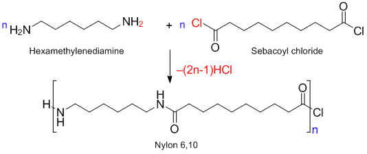

### В твердой фазе

Поликонденсация в твердой фазе изучена пока недостаточно, но она представляет большой теоретический и практический интерес. Обычно используются процессы, в которых первая стадия протекает в растворе или расплаве, а последняя стадия — в твердой фазе. Примером такого процесса является трехмерная поликонденсация, широко применяемая в настоящее время в промышленности для получения ряда смол (фенолоальдегидных, эпоксидных и др).

Получение фенолформальдегидных смол:

## Источники

* Семчиков Ю. Д. Высокомолекулярные соединения, с. 257–266.
* Кузнецов Е. В., Прохорова И. П. Альбом технологических схем производства полимеров и пластических масс на их основе, с. 74.
* Травень В. Ф. Органическая химия: учебник для вузов, т. 2, с. 221–222.

