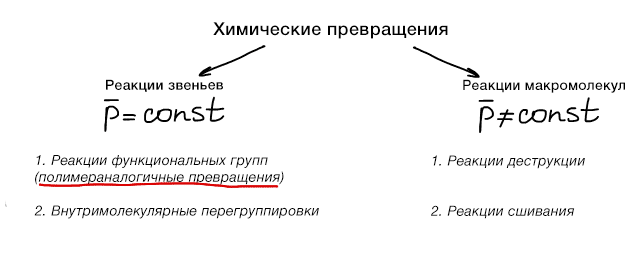
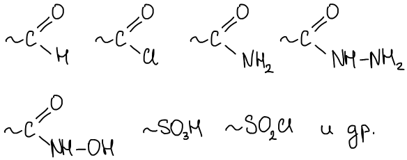
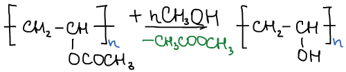
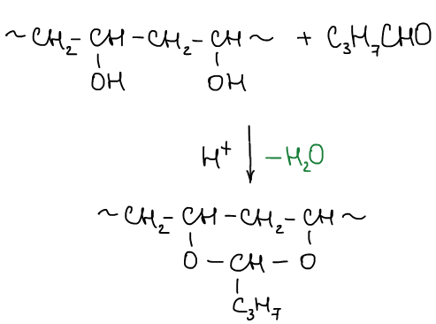
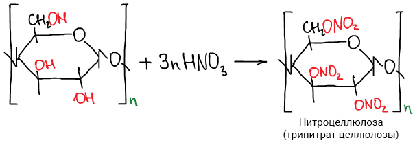
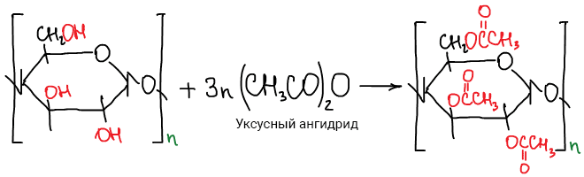

# Полимераналогичные превращения

**Полимераналогичные превращения** — это химические реакции макромолекул с низкомолекулярными соединениями, в процессе которых изменяется природа функциональных групп полимера, но сохраняется длина и строение скелета основной цепи.

В реакции полимераналогичных превращений могут вступать макромолекулы с самыми разнообразными функциональными группами, например:

Использование полимераналогичных превращений открывает широкие возможности химической модификации полимеров и получения новых полимерных материалов, в частности таких, которые трудно или невозможно синтезировать другим путем. Так, поливиниловый спирт получают с помощью полимераналогичных превращений: алкоголизом поливинилацетата:

Так же проводят дальнейшую обработку поливинилового спирта: при взаимодействии с уксусным альдегидом и кетонами образуются полуацетали и полукетали, являющиеся хорошими пленкообразующими материалами. Например, реакция получения поливинилбутираля, широко применяемого в многослойных стеклах типа "триплекс":

Различные эфиры целлюлозы получают в промышленности путем ее этерификаци:

 

Целлюлозу крайне сложно растворить и подвергнуть дальнейшим химическим превращениям, однако в среде подходящего растворителя, например, в ионной жидкости, такой процесс можно осуществить эффективно.

Продукты полимераналогичных превращений при степенях конверсии, отличных от 100%, представляют собой сополимеры, построенные из непрореагировавших и прореагировавших звеньев. Рассмотрим причины неполной конверсии.

Прежде всего, полимераналогичные превращения часто не доходят до конца **вследствие  значительного изменения растворимости полимера.** C глубиной конверсии частично превращенный полимер выпадает в осадок, «уводя» непрореагировавшие группы из реакционной зоны.

Исследование реакционной способности макромолекул в полимераналогичных превращениях опирается на **принцип Флори**, постулирующий независимость реакционной способности функциональной группы от длины цепи, с которой эта группа связана. Этот принцип дает возможность количественно описывать кинетику полимераналогичных превращений для образцов полимеров, состоящих из макромолекул различной степени полимеризации. Более того, во многих случаях функциональные группы в полимерах не отличаются по реакционной способности от соответствующих низкомолекулярных аналогов.

Однако, **данный принцип работает не всегда**. Для многих полимераналогичных превращений реакционные способности функциональных групп макромолекул и их низкомолекулярных аналогоов существенно различны, и характеризуются специфичными особенностями.

Эти особенности проявляются даже в случае разбавленных растворов. В таких растворах макромолекулы принимают форму статистических клубков. Если молекулы растворителя и низкомолекулярного реагента значительно отличаются по полярности от макромолекулы или ее фрагментов, то вследствие эффектов избирательной сольватации и сорбции они могут неравномерно распределяться между клубком и остальной частью раствора. Такой клубок можно рассматривать как **микрореактор**, в котором реакционная среда и локальные концентрации реагентов будут существенно различными, чем для раствора в целом. Уже по этой причине измеряемые константы скоростей могут значительно отличаться от низкомолекулярных аналогов.

Электростатические эффекты проявляются при взаимодействии **полиионов с заряженными реагентами**. Возможно **электростатическое отталкивание** в случае одноименных зарядов на макромолекуле и низкомолекулярном реагенте (скорость реакции падает) и **электростатическое притяжение** в случае разноименных зарядов (скорость реакции возрастает).

## Эффект соседних звеньев

Реакционная способность полимераналогичных превращений так же зависит **от индукционного влияния** соседних функциональных групп (скорость реакции падает).

Но эффект соседа может также ускорять реакцию, если в результате реакции образуется **переходных 6-членный цикл**.

Влияет на реакционную способность также то, **какой конфигурацией обладает макромолекула**. Обычно наиболее реакционноспособны изотактические полимеры, затем синдиотактические и атактические. Но так же есть реакции, в которых синдиотактический полимер более реакционноспособен, чем другие.

Реакционная способность функциональных групп при полимераналогичных превращениях в сильной степени связана также с **конформационными характеристиками** макромолекул. Прежде всего, при конформационных переходах изменяется доступность функциональных групп для атаки внешних агентов.

Например, константа скорости дейтеро-водородного обмена по связи N—Н в поли-N-винилацетамиде в 20 раз меньше, чем константа скорости такого обмена для N-метилацетамида, а энергии активации обмена практически одинаковы для полимера и низкомолекулярного модельного соединения. Для объяснения этого факта предполагается, что макромолекула претерпевает быстрые конформационные переходы, при этом амидогруппа ~95% времени **экранирована близлежащим участком цепи** от атаки молекул D2O; когда же атака возможна, амидогруппа в полимере не отличается по реакционной способности от низкомолекулярного аналога. Экранирование функциональных групп особенно резко выражено в случае стабилизированных специфических конформаций, свойственных глобулярным белкам.

