# Радикальная полимеризация: механизм, кинетика и термодинамика

**Радикальная полимеризация** — процесс получения ВМС из низкомолекулярных соединений без выделения побочных продуктов, где активный центр — свободно-радикальная частица (частица с неспаренным электроном). Данный процесс осуществляется за счет кратных связей ($С=С$, $С=О$ и др.) или раскрытия циклов, содержащих гетероатомы ($N$, $S$, $O$).

Продукты полимеризации имеют тот же элементный состав, что и исходные мономеры.

🙏 Если вам нравится сайт, подпишитесь на наш <a href="https://t.me/+JfpTv9CJlwQ0MThi">🔗 Телеграм-канал</a>.

## Механизм реакции

В реакцию полимеризации вступают соединения, которые содержат по крайней мере одну кратную связь или циклы. Реакционная способность мономера зависит от его строения, сопряжения двойной связи в молекуле мономера, количества и взаимного расположения заместителей, их поляризационного явления на двойную связь.

Радикальная полимеризация протекает по цепному механизму и описывается кинетикой неразветвленной цепной реакции.

Основные стадии цепной реакции:

1. **Инициирование** — образование активных центров;
2. **Рост цепи** — последовательное присоединение мономеров к активному центру;
3. **Обрыв цепи** — гибель активного центра;
4. **Передача цепи** — передача активного центра на другую молекулу.

### I. Инициирование цепи (зарождение)

Данная стадия является самой энергоемкой. Различают *физическое* и *химическое* инициирование.

#### Физическое инициирование

* Термоинициирование — инициирование при высоких температурах.
* Фотоинициирование — инициирование под действием света.
* Использование лучей высокой энергии —

    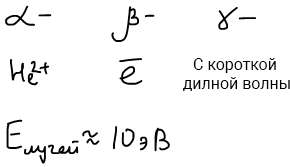

* Механоинициирование — инициирование в результате удара.

#### Химическое инициирование

Данный способ инициирования применяется чаще всего. Принцип заключается в использовании *веществ-инициаторов* (перекиси, азосоединения, red-ox системы), у которых энергия обрыва химической связи значительно меньше, чем у мономеров. При этом процесс происходит в две стадии: сначала генерируются радикалы инициатора, которые затем присоединяются к молекуле мономера, образуя первичный мономерный радикал.

1 стадия:

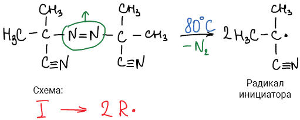

2 стадия:

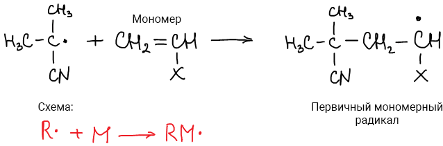

Инициатор очень похож по свойствам на катализатор, но *его отличие* состоит в том, что *инициатор расходуется* в процессе химической реакции, а катализатор - нет.

#### Примеры инициаторов:

* Перекись бензоила

    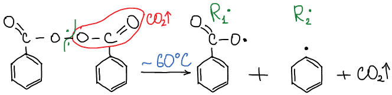

* Динитрил азобисизомасляной кислоты

    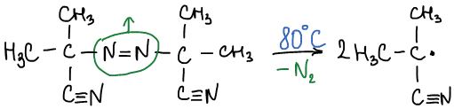

* Соли металлов переменной валентности (ОВР)

    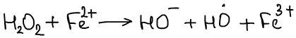

### II. Рост Цепи

Мономеры поочередно присоединяются к активному центру первичного мономерного радикала.

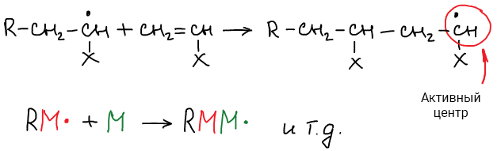

### III. Обрыв цепи

Обрыв цепи происходит в результате гибели активных центров (обрыв кинетической цепи).

* **Обрыв кинетической цепи** — исчезают активные центры;
* **Обрыв материальной цепи** — когда данная цепь перестает расти, но активный центр передается другой макромолекуле или мономеру (реакция передачи цепи).

Реакции приводящие к гибели кинетической и материальной цепи – реакции *рекомбинации* и *диспропорционирования.* 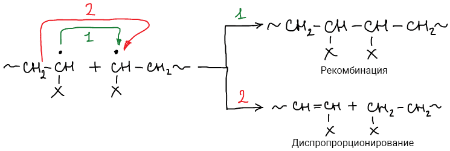

Вид реакции обрыва цепи (рекомбинация или диспропорционирование) зависит от ряда факторов, в частности от строения молекулы мономера. Если мономер содержит громоздкий по размеру или электроотрицательный по химической природе заместитель, то столкновения таких растущих радикалов друг с другом не происходит и обрыв цепи осуществляется путем диспропорционирования. Например, в случае метилметакрилата:

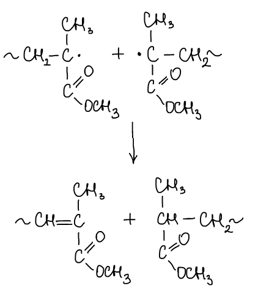

По мере роста радикалов увеличивается вязкость системы, и вследствие подвижности макрорадикалов скорость обрыва цепи путем рекомбинации снижается. Рост времени жизни макрорадикалов при увеличении вязкости системы приводит к интересному явлению – ускорению полимеризации на поздних стадиях (**гель-эффект**) вследствие увеличения концентрации макрорадикалов.

### IV. Передача цепи

Передача цепи происходит путём отрыва растущим радикалом атома или группы атомов от какой-то молекулы . Реакция передача цепи приводит к обрыву материальной цепи, а рост кинетической продолжается.

Различают передачу цепи:

* через полимер — приводит к получению разветвленных полимеров (ухудшение свойств полимеров)

    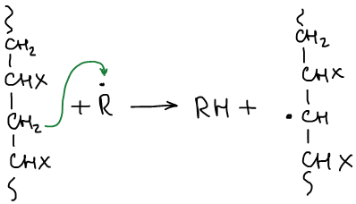

* через растворитель — приводит к получению полимеров с меньшей молекулярной массой

    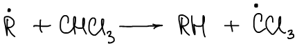

* через мономер — обрывается материальная цепь, продолжается кинетическая

    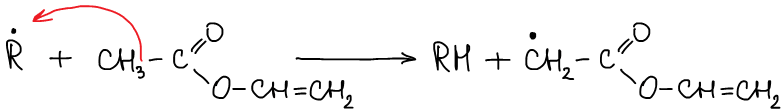

Особенности радикальной полимеризации:

* Высокая скорость полимеризации;
* Разветвленность;
* Возможны присоединения г-г, г-хв, хв-хв;
* Полимолекулярные полимеры.

## Кинетика радикальной полимеризации

**Химическая кинетика** — это раздел химии, изучающий механизм и закономерности протекания химической реакции во времени, зависимости этих закономерностей от внешних условий.

Для изучения кинетики радикальной полимеризации необходимо рассмотреть зависимость скорости реакции и степени полимеризации от концентрации исходных веществ, давления и температуры.

Обозначения:

![Обозначения концентрации инициатора [I] и мономера [M]](images/radikalnaya-polimerizaciya/Kin_clip_image001.png)

### I. Влияние концентрации исходных веществ на скорость реакции.

Общая скорость реакции зависит от скорости образования  радикалов Vин (скорости инициирования) , от скорости роста цепи Vр и ее обрыва Vo.

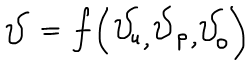

Мы будем рассматривать реакцию свободнорадикальной полимеризации, когда инициирование осуществляется с помощью химических инициаторов.

**Рассмотрим каждую стадию:**

1. Инициирование:

    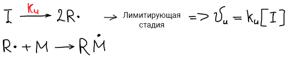

2. Рост цепи:

    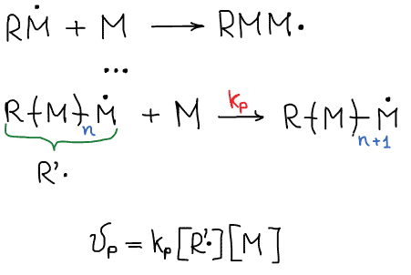

3. Обрыв цепи:

    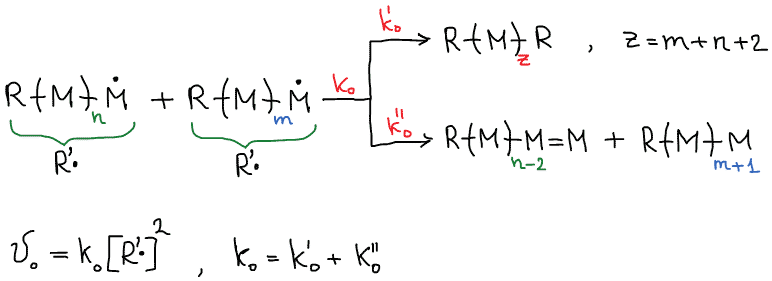

Рассмотрение кинетики существенно облегчается, если реакция протекает в  условиях, близких к **стационарному режиму**, при котором *скорости возникновения и  исчезновения свободных радикалов можно считать равными*. При этом концентрация  активных центров будет постоянна. 

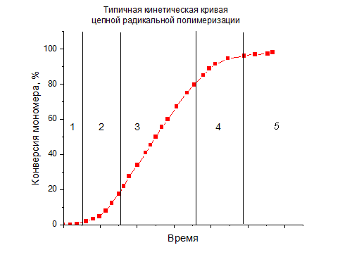

Как видно из графика кривой можно выделить пять участков по значениям скоростей основной реакции превращения мономера в полимер в результате полимеризации:

1 — участок ингибирования, где концентрация свободных радикалов мала. И они не могут начать цепной процесс полимеризации;

2 — участок ускорения полимеризации, где начинается основная реакция превращения мономера в полимер, причем скорость растет;

3 — **участок стационарного состояния**, где происходит полимеризация основного количества мономера при постоянной скорости (прямолинейная зависимость конверсии от времени);

4 — участок замедления реакции, где скорость реакции уменьшается в связи с убылью содержания свободного мономера;

5 — прекращение основной реакции после исчерпания всего количества мономера.Стационарный режим наблюдается обычно на начальной стадии протекания реакции, когда вязкость реакционной массы невелика и равновероятны случаи зарождения цепи и ее обрыва.

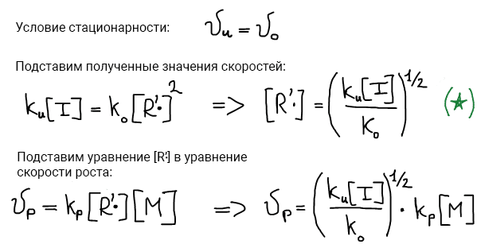

Таким образом скорость реакции роста цепи равна:

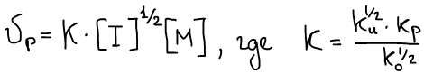

### II. Влияние концентрации исходных веществ на степень полимеризации.

Степень полимеризации зависит от соотношения скоростей роста и обрыва цепи:

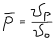

Учтем соответствующие выражения для скоростей

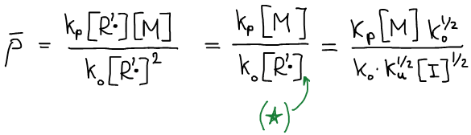

Степень полимеризации равна:

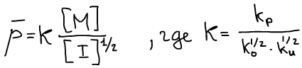

### III. Влияние температуры на скорость реакции роста цепи.

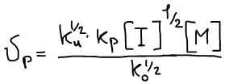

Уравнение Аррениуса:

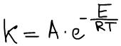

Выполним подстановку уравнения Аррениуса в уравнение скорости роста цепи:

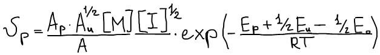

Прологарифмируем полученное выражение:

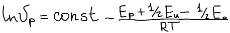

Энергия активации роста ~ 6 ккал/моль;

Энергия активации инициирования ~30 ккал/моль;

Энергия активации обрыва ~8 ккал/моль.

Числитель (6+15-4 = 17) больше нуля, значит, чем больше температура, тем выше  скорость реакции радикальной полимеризации. Однако с ростом температуры  увеличивается и вероятность столкновения радикалов друг с другом (обрыв цепи путем  диспропорционирования или рекомбинации) или с низкомолекулярными примесями. В  результате молекулярная масса полимера в целом уменьшается, увеличивается доля  низкомолекулярных фракций в полимере. Возрастает число побочных реакций,  приводящих к образованию разветвленных молекул. Увеличивается нерегулярность при  построении цепи полимера вследствие возрастания доли типов соединения мономера  «голова к голове» и «хвост к хвосту».

### IV. Влияние температуры на степень полимеризации.

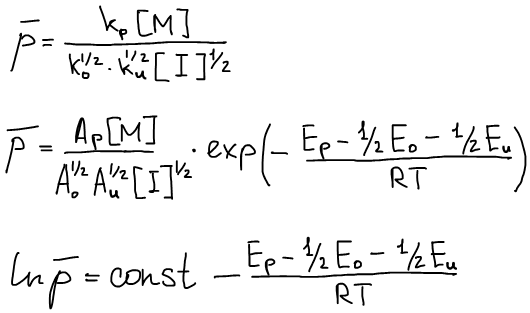

Энергия активации роста ~ 6 ккал/моль;

Энергия активации инициирования ~30 ккал/моль;

Энергия активации обрыва ~8 ккал/моль.

Числитель (6-15-4 = -13)  меньше нуля, значит с ростом температуры степень  полимеризации уменьшается.  В результате молекулярная масса полимера в целом  уменьшается, увеличивается доля низкомолекулярных фракций в полимере.

### V. Влияние давления на скорость полимеризации

Принцип Ле-Шателье: Если на систему оказывается внешнее воздействие, то в системе активируются  процессы, ослабляющие это воздействие.

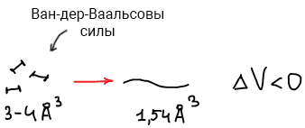

Чем выше давление, тем выше скорость радикальной полимеризации. Однако чтобы повлиять на свойства конденсированных систем, нужно прикладывать давление в несколько тысяч атмосфер.

Особенностью полимеризации под давлением является то, что увеличение скорости не сопровождается уменьшением молекулярной массы получаемого полимера.

### Ингибиторы и замедлители полимеризации.

Явления обрыва и передачи цепи широко используются на практике для:

* предотвращения преждевременной полимеризации при хранении мономеров;
* для регулирования процесса полимеризации

В первом случае к мономерам добавляют **ингибиторы** или **стабилизаторы**, которые вызывают обрыв цепи, а сами превращаются в соединения, не способные инициировать полимеризацию. Также они разрушают пероксиды, образующиеся при взаимодействии мономера с атмосферным кислородом.

**Ингибиторы**: хиноны, ароматические амины, нитросоединения, фенолы.

**Регуляторы** полимеризации вызывают преждевременный обрыв материальной цепи, снижая молекулярную массу полимера пропорционально введенному количеству регулятора. Примером их являются меркаптаны.

## Термодинамика радикальной полимеризации

Реакция роста цепи обратима, наряду с присоединением мономера к активному центру может происходить и его отщепление-деполимеризация.

Термодинамическая возможность полимеризации, как и любой другой равновесный химический процесс можно описать с помощью функций Гиббса и Гельмгольца:

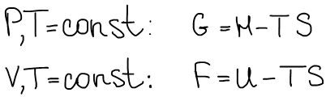

Однако функция Гиббса наиболее приближена к реальным условиям, поэтому мы воспользуемся ей:

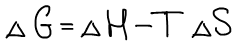

Так же изменение функции Гиббса связано с константой равновесия реакции уравнением:

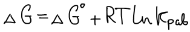

Константа полимеризационно-деполимеризационного равновесия при достаточно большом молекулярном весе образующегося полимера (p>>1) зависит только от равновесной концентрации мономера:

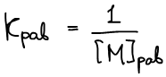

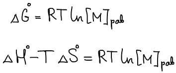

Откуда следует, что

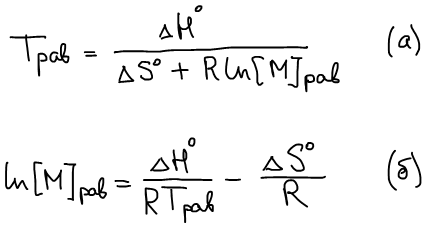

Из уравнения (а) можно найти такую температуру, при которой реакция полимеризации не будет идти, а из уравнения (б) можно найти равновесную концентрацию мономера, при превышении которой будет происходить полимеризация.

### Влияние температуры

Для определения влияния температуры на равновесную концентрацию мы представим уравнение (б) в следующем виде:

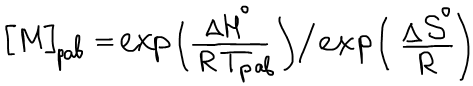

В случае, когда ΔH°<0 и ΔS°<0 с ростом температуры увеличивается равновесная концентрация  мономера. Верхний предел ограничен концентрацией мономера в массе. Это значит, что  есть некоторая верхняя предельная температура — Тв.пр., выше которой полимеризация  невозможна.

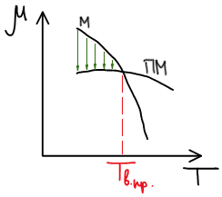

В случае, когда ΔH°>0 и ΔS°>0 наблюдается обратная зависимость: с уменьшением температуры увеличивается равновесная концентрация мономера. Следовательно, для мономеров с отрицательным тепловым эффектом существует нижняя предельная температура Тн.пр.

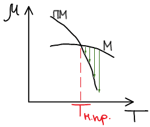

Так же есть известные случаи, когда эти зависимости не пересекаются, но они не представляют практического интереса.

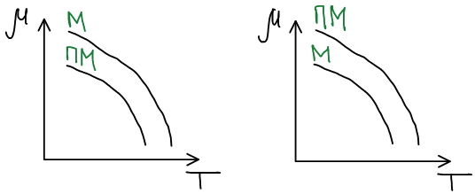

### Термодинамическая вероятность

Теперь рассмотрим термодинамическую возможность протекания реакции, условием которой является равенство ΔG<0. Оно определяется как изменением энтальпии так и энтропии, причем вклад энтропийного члена будет изменяться с температурой реакции.

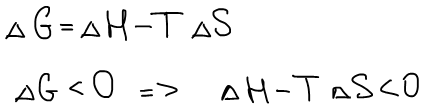

При полимеризации по кратным связям энтропия системы всегда уменьшается, т.е. процесс по энтропийным соображениям невыгоден. Слабая зависимость ∆S° от природы мономера связана с тем, что основной вклад в ∆S° вносит потеря поступательных степеней свободы молекул мономеров.

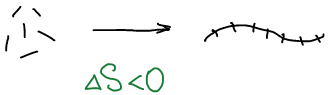

Но также известны мономеры, для которых при полимеризации происходит увеличение энтропии. Такое изменение ∆S° характерно для некоторых ненапряженных циклов. Причем, поскольку полимеризация оказывается выгодной с энтропийной точки зрения, она может протекать даже при отрицательных тепловых эффектах (полимеризация циклов S8 и Se8 с образованием линейных полимеров)

Расчеты и измерения энтропии для полимеризации большинства виниловых мономеров показывают, что ∆S° составляет около 120 Дж/К·моль.

Напротив, ∆Н° изменяется в зависимости от химического строения мономера в довольно широких пределах (∆Q° = −∆Н° варьируется от нескольких кДж/моль до 100 кДж/моль), что обусловлено различием природы кратной связи и ее заместителей. Отрицательные значения ∆Н° свидетельствуют о том, что полимеризация выгодна с точки зрения энтальпийного фактора. При обычных температурах порядка 25°С полимеризация термодинамически разрешима для мономеров, тепловой эффект которых превышает 40 кДж/моль. Это условие соблюдается для большинства виниловых мономеров. Однако, при полимеризации по С=О связи тепловые эффекты ниже 40 кДж/моль. Поэтому условие ∆G<0 соблюдается только при достаточно низких температурах, когда \|TΔS°\|<\|ΔH°\|.

### Рассмотрим явление несоответствия теоретической и практической энтальпии полимеризации 

Полимеризация стирола:

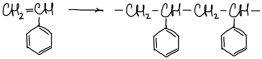

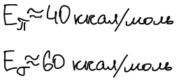 

Выделяется меньшее количество энергии, куда она девается?

1. Разрушается эффект сопряжения;
2. Стерическое отталкивание (при синтезе полистирола образуется спиральная молекула за счет стерического отталкивания).

### Полимеризация циклов

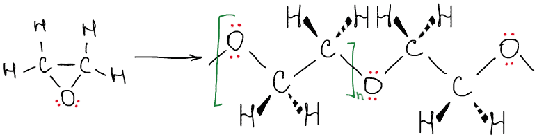

Причина возрастания Q при полимеризации циклов — термодинамчески не выгодный валентный угол между гибридизованными орбиталями и отталкивание неподеленных электронных пар заместителя.

Стадии:

1. Раскрытие цикла (ΔS1° > 0)
2. Рост цепи (ΔS2° < 0)

ΔS° = ΔS1° + ΔS2°, ΔS° может быть больше или меньше нуля.

