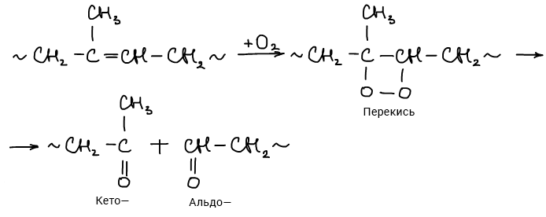
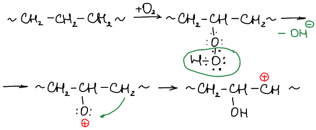
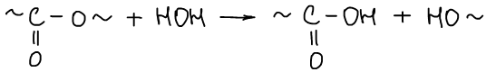
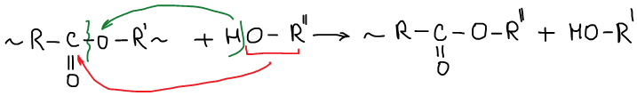
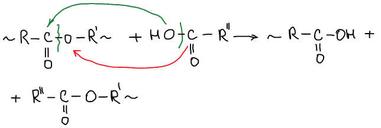
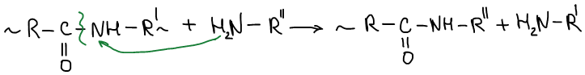
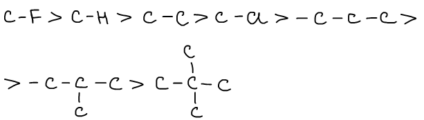
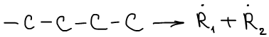
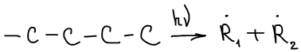

# Реакции деструкции: химическая и физическая.

**Реакции деструкции** — реакции, приводящие к разрыву химической связи в макромолекулах. Вследствие чего возможно уменьшение степени полимеризации и молекулярной массы полимера.

Различают химическую и физическую деструкции:

## Химическая деструкция

### 1. Окислительная деструкция

### 2. Гидролиз

### 3. Алкоголиз \(под действием спиртов\)

### 4. Ацетолиз \(под действием кислоты\)

### 5. Аминолиз \(под действием аминов\)

## Физическая деструкция

### 1. Термодеструкция \(под действием температуры\)

**Термостойкость** — способность веществ сохранять свое химическое строение при росте температуры.

**Термоустойчивость** — способность веществ сохранять механические свойства при росте температуры.

Прочность связи по отношению к термодеструкции:

### 2. Механодеструкция \(под действием механического напряжения\)

Возникают радикалы разного сорта — получают блок-сополимеры.

### 3. Фотодеструкция \(под действием света\)

Некоторые полимеры разрушаются, другие — сшиваются.

### 3. Радиолиз \(под действием лучей высоких энергий α, β, γ\)

Также может происходить деструкция или сшивание.

