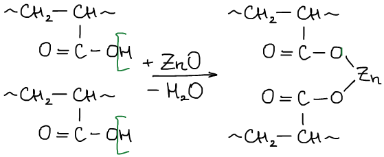

# Реакции сшивания

**Реакции сшивания** — реакции, которые приводят к росту молекулярной массы цепи: вулканизация и отверждение.

## Вулканизация

**Вулканизация** — технологический процесс получения резин и каучуков за счет соединения линейных макромолекул в сетку.

### Вулканизация ПХП (полихлоропреновый какучук)

### Вулканизация изопренового каучука (НК)

### Вулканизация СКЭП (синтетический каучук этиленпроипленовый)

### Вулканизация СКЭПТ (синтетический каучук этиленпропиленовый тройной)

### Вулканизация ПДМС (полидиметилсилоксан)

ПДМС устойчив при низкой температуре, совместим с биологическими тканями, прочный.

### Вулканизация кислот

## Отверждение

**Отверждение** — необратимое превращение жидких олигомеров в твердые нерастворимые полимеры с трехмерной структурой.

**Термопласты** — полимеры, которые при эксплуатации находятся в твердом состоянии, при повышении температуры размягчаются, а при понижении вновь возвращаются в прежнее состояние (н-р: полиэтилентерефталат).

**Термореактопласты** — при повышении температуры не размягчаются (фенолформальдегидные смолы, эпоксидные смолы, Si-органические полимеры).

### Получение фенолформальдегидных смол (отвердитель — уротропин)

### Сшивание эпоксидных смол

В качестве отвердителей для эпоксидных смол используют вещества, содежащие 2 и более функциональных групп, способных к присоединению к эпоксидной группе (многоосновные кислоты, их ангидриды и амины).

Наличие OH-групп в отвержденной смоле способствует хорошей адгезии к другим материалам. Поэтому их используют в качестве клея.

