# Сополимеризация

**Сополимеризация** — совместная полимеризация различных мономеров для получения полимеров с улучшенными свойствами. Например, сополимеризацией является реакция вулканизации каучуков:

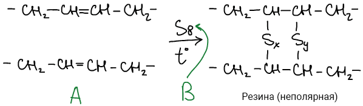

Резина будет растворяться в масле (неполярная), значит необходимо повысить полярность резины:

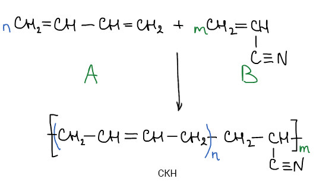

СКН — синтетический каучук нитрильный.

В России выпускается: СКН-18; СКН-26; СКН-40 — цифра характеризует процентное содержание акрилонитрила в реакционной смеси.

В реакционной смеси возможно протекание четырех элементарных реакций роста цепи:

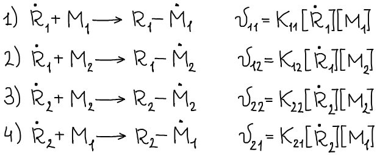

Здесь R1\* и R2\* – растущие макрорадикалы, оканчивающиеся звеньями M1 и М2.

Скорости расходования мономеров M1 и M2 в процессе сополимеризации определяются уравнениями:

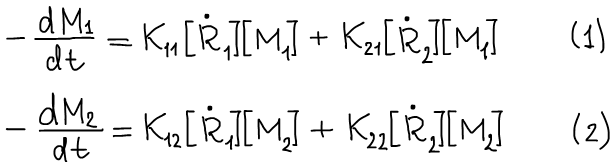

Разделив (1) на (2) получим:

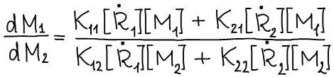

Для стационарного процесса реакции можно считать, что выполняется равенство:

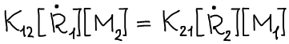

При малых степенях превращения отношения скоростей расходования двух мономеров, или отношение концентраций мономерных звеньев в сополимере m1/m2 может быть описано уравнением, полученным Майо:

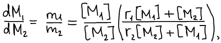 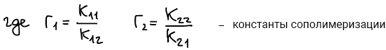

Константы сополимеризации характеризуют отношение констант скоростей взаимодействия радикалов со "своим" и "чужим" мономером.

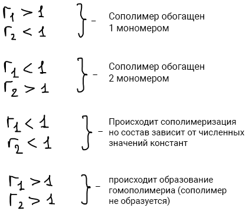 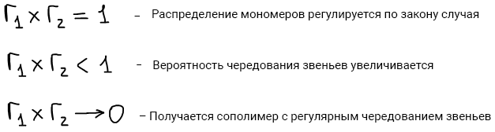

🙏 Если наш сайт помог вам, расскажите о нем друзьям и одногруппникам. И подпишитесь на наш <a href="https://t.me/+JfpTv9CJlwQ0MThi">🔗 Телеграм-канал</a>.

## "Схема Q - е" Алфрея – Прайса

Учет полярных факторов был сделан в рамках полуэмпирической схемы, называемой схемой "Q-е", в которой принимают, что

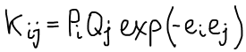

Где Pi и Qj — параметры, соответствующие энергиям сопряжения в мономере j и радикале i, согласно теории идеальной радикальной реакционной способности. Величины еi и еj учитывают поляризацию реагирующих мономеров.

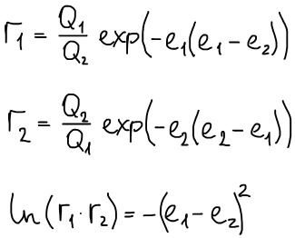

Используя эту схему, удалось оценить относительную реакционную способность мономеров и роль полярных факторов для большого числа пар сополимеризующихся мономеров.

За стандарный мономер был принят **стирол** со значениями:

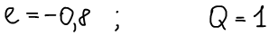

При сополимеризации стирола с другими мономерами (Mj) последние были охарактеризованы своими значениями *Q* и *e* что дало возможность предсказать поведение этих мономеров в реакциях сополимеризации с другими мономерами, для которых также были установлены значения *Q* и *e*.

Активные мономеры: Q>0,5

Неактивные мономеры: Q<0,1

Электродонорные: e<0 Электроакцепторные: e>1

 Хотя схема "Q-е" не имеет полного теоретического обоснования, с практической точки зрения она оказалась полезной.

