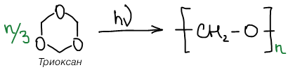
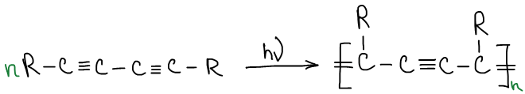

# Основные способы проведения полимеризации

## 1. Полимеризация в массе (блок)

Мономер — жидкость. Инициатор и агент передачи цепи растворяется в мономере.

**Преимущества**:

-   Минимальное количество компонентов;
-   Отсутствие стадии выделения полимера из реакционной среды;
-   Позволяет получить полимеры с высокой степенью чистоты;
-   Единственный способ получения оптического органического стекла;
-   Минимальное загрязнение окружающей среды.

**Недостатки**:

-   Сложность отведения тепла при глубокой степени превращения;
-   Тепловые флуктуации приводят к образованию широкого ММР;
-   Локальные флуктуации температуры приводят к деструкции;
-   Локальное испарение мономера и образвание дефектов (раковин).

**Применение**:

Используют при радикальной полимеризации метилметакрилата и стирола, также полимеризуют винилхлорид для получения поливинилхлоридных смол.

## 2. Полимеризация в растворе

Мономер, инициатор и агент передачи цепи растворяют в инертном растворителе.

**Преимущества:**

-   Процесс происходит с одновременным отводом тепла;
-   Возможность варьировать концентрацию мономера в растворе;
-   Возможность варьировать температуру в широких пределах;
-   Возможность получать высоковязкие полимеры;
-   Возможность получения олигомеров с реакционноспособными концевыми группами;
-   Возможность получения лаков - концентрированных растворов полимеров.

**Недостатки**:

-   Необходимость отделения растворителя и сушки полимера;
-   Необходимость регенерации растворителя;
-   Значительные энергозатраты;
-   Существует конечная вероятность передачи цепи на растовритель, что затрудняет получение очень высокомолекулярных продуктов.

**Применение**:

Используют при радикальной полимеризации акрилонитрила и катионной полимеризации изобутилена.

## 3. Суспензионная полимеризация

Мономер диспергируют в воде в виде мелких капель, мономер должен быть водонерастворимым.

**Преимущества**:

-   Эффективное теплоотведение из реакционной системы;
-   Контроль за длиной кинетических цепей (неширокое молекулярно-массовое распределение);
-   Легкость отделения от воды;
-   Простота переработки готового продукта.

**Недостатки**:

-   Основная проблема — необходимость сохранения системы в дисперсном состоянии;
-   Необходимость применения стабилизаторов суспензий — ПВС или тонкодисперсные минеральные порошки;
-   Необходимость регенерации растворителя, очистки сточных вод;
-   Необходимость извлечения из полимера остатков стабилизатора.

**Применение**:

Используют для получения полистирольных гранул (из которых получают пенополистирол), полистирол-дивинил бензольных гранул (для изготовления ионобменных смол) и гранул поливинилацетата (используемых в дальнейшем для превращения в поливиниловый спирт).

## 4. Эмульсионная (латексная) полимеризация

Мономер диспергируют в водной фазе в виде однородной эмульсии.

**Преимущества**:

-   Высокая скорость полимеризации;
-   Небольшое изменение вязкости;
-   Легкость регулирования теплопереноса;
-   Использование воды в качестве растворителя;
-   Возможность получать высокомолекулярные соединения с узким значением ММР;
-   Возможность регулировать ММ соотношением мономер / ПАВ / вода;
-   Возможность использовать полученные эмульсии полимеров для производства изделий методом смачивания.

**Недостатки**:

-   Необходимость использования дополнительных веществ (ПАВ, эмульгаторы);
-   Очистка большого количества сточных вод;
-   Для выделения полимера из эмульсии необходим каогулянт;

**Применение**:

Проводят полимеризацию винилхлорида, бутадиена, хлоропрена, винилацетата, акрилатов и метакрилатов.

## 5. Полимеризация в газовой фазе:

Используется, если мономер характеризуется низкой критической температурой кипения.

**Преимущества**:

-   Нет необходимости применять растворители;
-   Возможно эффективно применять фото- и радиоинициирование;

**Недостатки**:

-   Необходимость применения высокого давления (~108 Па);
-   Очень плохой отвод тепла;
-   Изменение кинетики полимеризации при появлении твердой фазы;

Свойства конечных продуктов, таких, как средине молекулярные массы, молекулярно-массовое распределение, молекулярная структура и химическая однородность, значительно зависят от следующих факторов:

-   Эффективность теплоотвода при полимеризации;
-   Одинакового времени пребывания реагентов в зоне реакции;
-   Эффективности перемешивания, обеспечивающего однородный температурный профиль и равномерное распределение реагентов в реакционной среде;

**Применение:**

Проводят полимеризацию этилена, тетрафторэтилена, п-ксилола и др.

## 6. Полимеризация в твердой фазе

Полимеризация мономеров, находящихся в кристаллическом или стеклообразном состоянии. Получают полимеры в стереорегулярном виде, а также из полисопряженных молекул получаются высококристаллические электропроводящие полимеры (последний пример).

Используется  фото- и радиоинициирование:

 

