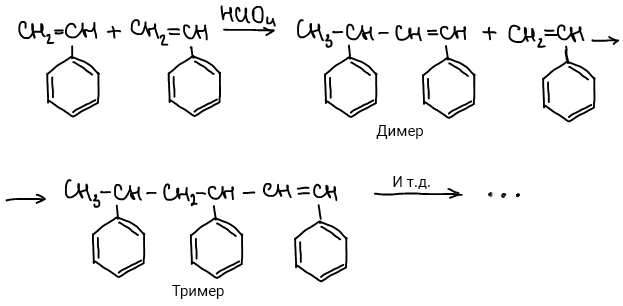
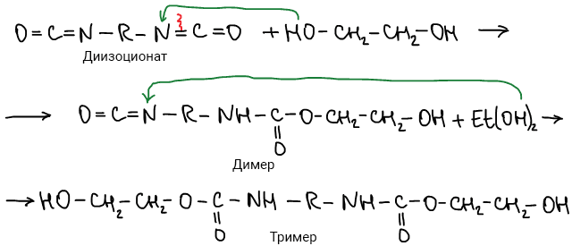
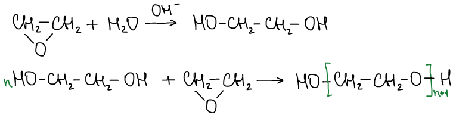
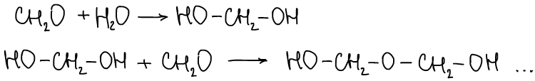

# Ступенчатая полимеризация: особенности и примеры

**Ступенчатая полимеризация** протекает так же как и цепная полимеризация(состав продукта одинаков с составом мономера), но отличие состоит в том, что реакция идет через образование промежуточных устойчивых соединений: ди-, три-, тетра-, пентамеров и т. д.

🙏 Если наш сайт помог вам, расскажите о нем друзьям и одногруппникам. И подпишитесь на наш <a href="https://t.me/+JfpTv9CJlwQ0MThi">🔗 Телеграм-канал</a>.

## Особенности ступенчатой полимеризации

1. Образующиеся промежуточные продукты устойчивы и могут быть выделены из сферы реакции;
2. В данных процессах не участвуют активные центры.
3. Реакционная способность промежуточных соединений и исходного мономера одинакова.
4. Каждая стадия роста полимерной цепи протекает с высокой энергией активации.
5. Ступенчатая полимеризация — обратимый процесс.

## Примеры ступенчатой полимеризации

Полимеризация стирола:

Синтез полиуретана:

Полимеризация этиленоксида в присутствии оснований:

Полимеризации формальдегида в пристутствии следов воды:

