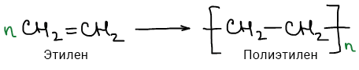
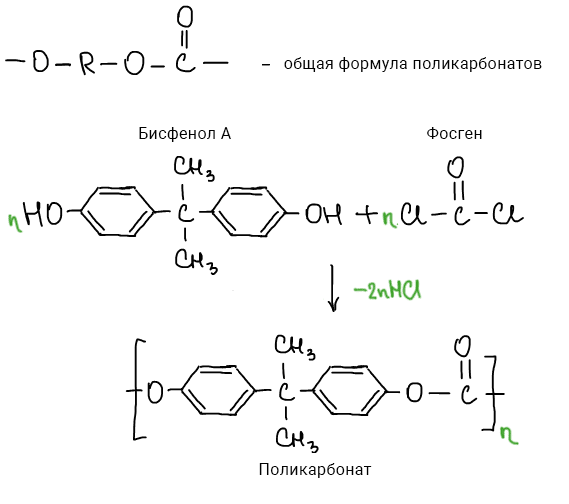
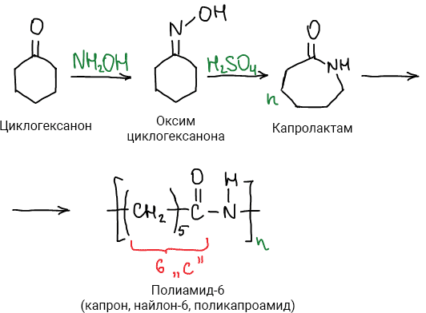
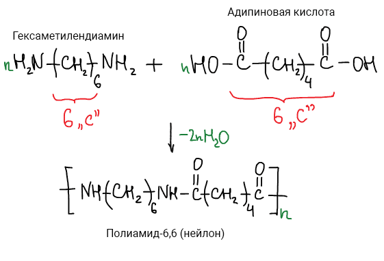
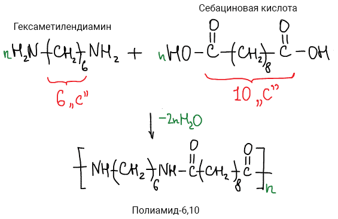
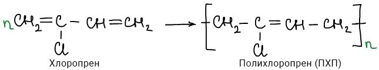
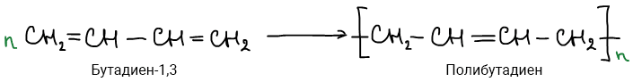
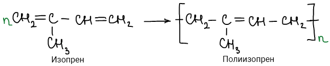
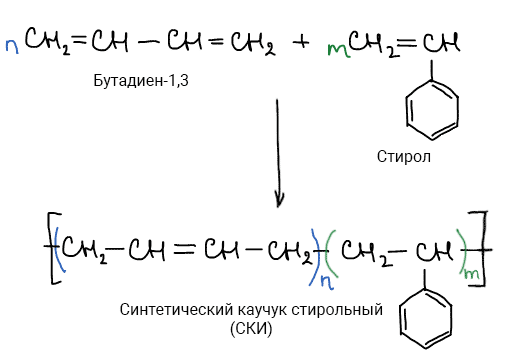
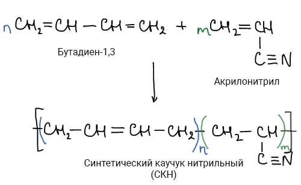

# Важнейшие полимеры

|**Тип**|**Название**|**Сокращение**|
|Пластмассы|[Полиэтилен](#pe)|[ПЭ](#pe)|
|[Полипропилен](#pp)|[ПП](#pp)|
|[Полистирол](#ps)|[ПС](#ps)|
|[Поливинилхлорид](#pvh)|[ПВХ](#pvh)|
|[Полиметилметакрилат](#pmma)|[ПММА](#pmma)|
|[Полиакрилонитрил](#pan)|[ПАН](#pan)|
|[Поликарбонат](#pk)|[ПК](#pk)|
|[Полиамид-6](#pa-6)|[ПА 6](#pa-6)|
|[Полиамид-6,6](#pa-6-6)|[ПА 6,6](#pa-6-6)|
|[Полиамид-6,10](#pa-6-10)|[ПА 6,10](#pa-6-10)|
|[Полиэтилентерефталат](#petf)|[ПЭТФ](#petf)|
|[Политетрафторэтилен](#ptfe)|[ПТФЭ](#ptfe)|
|Каучуки|[Натуральный каучук](#nk)|[НК](#nk)|
|[Полибутадиен](#pb)|[ПБ](#pb)|
|[Полиизабутилен](#pib)|[ПИБ](#pib)|
|[Полидиметилсилоксан](#pdms)|[ПДМС](#pdms)|
|[Полихлоропрен](#php)|[ПХП](#php)|
|[Синтетический каучук](#sk)|[СК](#sk)|
|[Синтетический каучук изопреновый ](#ski)|[СКИ](#ski)|
|[Синтетический каучук стирольный](#sks)|[СКС](#sks)|
|[Синтетический каучук метилстирольный](#skms)|[СКМС](#skms)|
|[Синтетический каучук нитрильный](#skn)|[СКН](#skn)|
|[Синтетический каучук этиленпропиленовый](#skep)|[СКЭП](#skep)|

## Полиэтилен (ПЭ)

## Полипропилен (ПП)

## Полистирол (ПС)

## Поливинилхлорид (ПВХ)

## Полиметилметакрилат (ПММА)

## Полиакрилонитрил (ПАН)

## Поликарбонат (ПК)

## Полиамид-6 (ПА-6, капрон, найлон-6)

## Полиамид-6,6 (ПА-6,6, нейлон)

## Полиамид-6,10 (ПА-6,10)

## Полиэтилентерефталат (ПЭТФ, ПЭТ, лавсан, майлар)

## Политетрафторэтилен (ПТФЭ, тефлон, фторопласт-4)

## Натуральный каучук (НК)

Всего существует 12 изомеров полиизопрена и только один из них натуральный. Сложно синтезировать, в природе содержится в млечном соке гевеи, кок-сагыза и других каучуконосных растений.

## Полибутадиен (ПБ)

## Полиизабутилен (ПИБ)

## Полидиметилсилоксан (ПДМС)

## Полихлоропрен (ПХП)

## Синтетический каучук (СК)

Самый первый синтезеированный каучук - дивиниловый 

## Синтетический каучук изопреновый (СКИ)

## Синтетический каучук стирольный (СКC)

СКC - сополимер бутадиена и стирола.

## Синтетический каучук метилстирольный (СКМС)

СКМС - сополимер бутадиена и метилстирола.

## Синтетический каучук нитрильный (СКН)

СКН - сополимер бутадиена и акрилонитрила.

## Синтетический каучук этиленпропиленовый (СКЭП)

СКЭП - сополимер этилена и пропилена.

 

