---
description: Список важнейших полимеров и их сокращений.
--- 

# Важнейшие полимеры

🙏 Если наш сайт помог вам, расскажите о нем друзьям и одногруппникам. И подпишитесь на наш <a href="https://t.me/+JfpTv9CJlwQ0MThi">🔗 Телеграм-канал</a>.

## Полиэтилен (ПЭ)

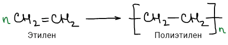

## Полипропилен (ПП)

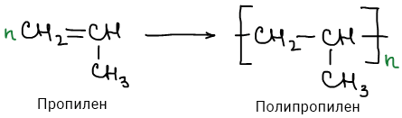

## Полистирол (ПС)

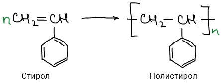

## Поливинилхлорид (ПВХ)

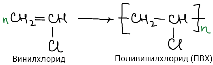

## Полиметилметакрилат (ПММА)

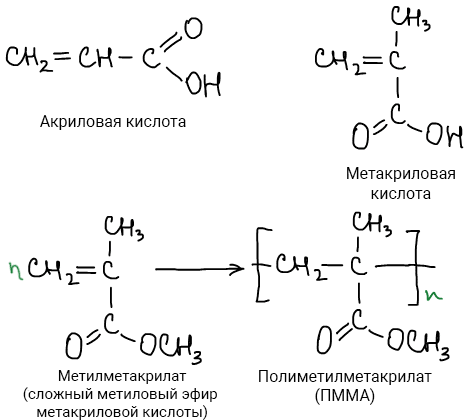

## Полиакрилонитрил (ПАН)

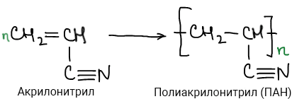

## Поликарбонат (ПК)

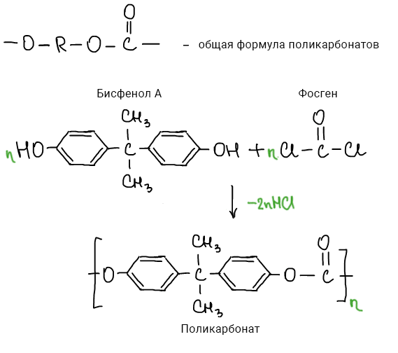

## Полиамид-6 (ПА-6, капрон, найлон-6)

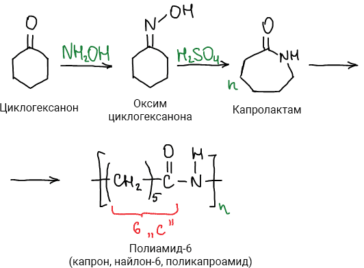

## Полиамид-6,6 (ПА-6,6, нейлон)

## Полиамид-6,10 (ПА-6,10)

## Полиэтилентерефталат (ПЭТФ, ПЭТ, лавсан, майлар)

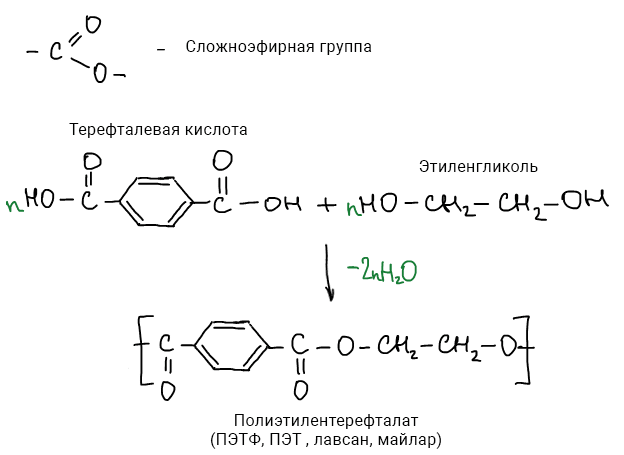

## Политетрафторэтилен (ПТФЭ, тефлон, фторопласт-4)

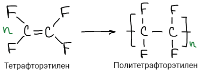

## Натуральный каучук (НК)

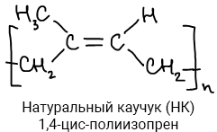Всего существует 12 изомеров полиизопрена и только один из них натуральный. Сложно синтезировать, в природе содержится в млечном соке гевеи, кок-сагыза и других каучуконосных растений.

## Полибутадиен (ПБ)

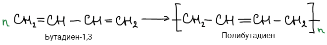

## Полиизабутилен (ПИБ)

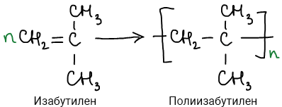

## Полидиметилсилоксан (ПДМС)

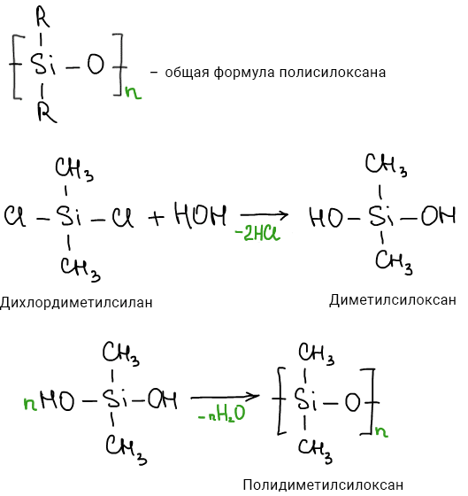

## Полихлоропрен (ПХП)

## Синтетический каучук (СК)

Самый первый синтезеированный каучук - дивиниловый 

## Синтетический каучук изопреновый (СКИ)

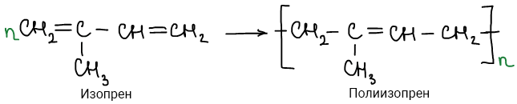

## Синтетический каучук стирольный (СКC)

СКC - сополимер бутадиена и стирола.

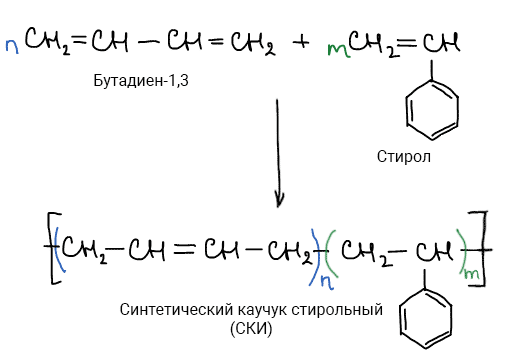

## Синтетический каучук метилстирольный (СКМС)

СКМС - сополимер бутадиена и метилстирола.

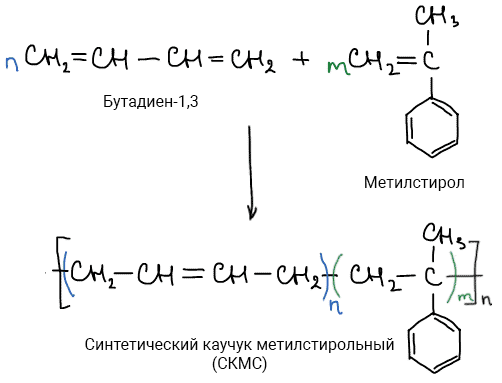

## Синтетический каучук нитрильный (СКН)

СКН - сополимер бутадиена и акрилонитрила.

## Синтетический каучук этиленпропиленовый (СКЭП)

СКЭП - сополимер этилена и пропилена.

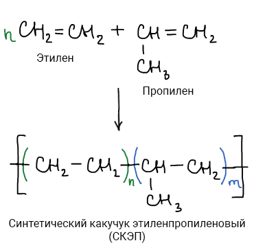

 

